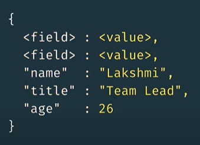

<h1>Mongo DB</h1>

**Índice**

- [¿Qué es Mongo DB?](#qué-es-mongo-db)
- [¿Qué es un documento?](#qué-es-un-documento)
- [¿Qué es una colección?](#qué-es-una-colección)
- [¿Qué es MongoDB Atlas?](#qué-es-mongodb-atlas)
  - [Clusters](#clusters)
  - [Replica Sets](#replica-sets)
  - [Servicios de Atlas](#servicios-de-atlas)
- [¿Cómo se almacena información en MongoDB?](#cómo-se-almacena-información-en-mongodb)
- [Import y Export data](#import-y-export-data)
- [Comandos iniciales en MongoDB](#comandos-iniciales-en-mongodb)
- [Query a los datos en MongoDB](#query-a-los-datos-en-mongodb)
- [Insertar un nuevo documento en MongoDB](#insertar-un-nuevo-documento-en-mongodb)
- [Actualizando un documento en MongoDB](#actualizando-un-documento-en-mongodb)
- [Eliminar un documento en MongoDB](#eliminar-un-documento-en-mongodb)
- [Operadores MQL](#operadores-mql)
- [Operadores de Consulta](#operadores-de-consulta)
- [Logical Operators](#logical-operators)
- [Expresive Query Operators](#expresive-query-operators)
- [Operadores de Arreglos](#operadores-de-arreglos)
- [Projection](#projection)
- [Consultando arreglos y sub-documentos](#consultando-arreglos-y-sub-documentos)
- [Aggregation Framework](#aggregation-framework)

## ¿Qué es Mongo DB?

Es una base de datos NOSQL que se basa en documentos, que se almacenan en colecciones. Los datos se almacenan de forma organizada y estructurada.

## ¿Qué es un documento?

Es una manera de organizar y almacenar datos como un set de field-value pair. Similar a un hash map.



## ¿Qué es una colección?

Una tienda organizada de documentos en MongoDB, usualmente con campos similares entre los documentos.


## ¿Qué es MongoDB Atlas?

Atlas es DB como un servicio.
MongoDB es usado como el Core de MongoDB Atlas para el almacenamiento y recuperación de datos.
Es la DB en la nube.

### Clusters

Grupo de servidores que almacenan información

### Replica Sets

Algunas instancias de MongoDB conectadas que almacenan la misma información.

> Una instancia es una maquina localmente o en la nube que corre un software específico.

### Servicios de Atlas

- Maneja la creación de clusters
- Corre y mantiene el deployment de databases
- Usa un servicio de la nube de tu preferencia
- Experimenta con nuevas herramientas y características

## ¿Cómo se almacena información en MongoDB?

Se utiliza el formato JSON (JavaScript Standard Object Notation) para almacenar la información.
Se utiliza el formato BSON (Binary JSON) para almacenar la información internamente y sobre la nube. Provee **velocidad y flexibilidad.**

> MongoDB almacena la información en formato BSON y luego la podemos ver en formato JSON


Para escribir correctamente un JSON:

- El conjunto de todos los datos deben estar encerrados entre llaves {}
- Cada par de datos deben estar separados por comas
- Cada field o cada key deben estar entre comillas simples o dobles

Ejemplo:

```json
{
  "name": "John",
  "age": 30,
  "cities": ["New York", "Tokyo"]
}
```

## Import y Export data

Tenemos varios métodos para importar y exportar datos de MongoDB.


Algunos ejemplos de uso:

```bash
mongodump --uri "mongodb+srv://<your username>:<your password>@<your cluster>.mongodb.net/sample_supplies"

mongoexport --uri="mongodb+srv://<your username>:<your password>@<your cluster>.mongodb.net/sample_supplies" --collection=sales --out=sales.json

mongorestore --uri "mongodb+srv://<your username>:<your password>@<your cluster>.mongodb.net/sample_supplies"  --drop dump

mongoimport --uri="mongodb+srv://<your username>:<your password>@<your cluster>.mongodb.net/sample_supplies" --drop sales.json
```

## Comandos iniciales en MongoDB

Comandos para explorar los datos en MongoDB:

```bash
# Listar todas las bases de datos
show dbs

# Empezar a usar una base de datos, si no existe, se crea
use sample_training

# Listar todas las colecciones
show collections

# Listar los datos de una colección donde se cumpla la condición
db.zips.find({"state": "NY"})
```

## Query a los datos en MongoDB

```js
// Para listar todos los datos de una colección
db.collection_name.find();

// Para listar todos los datos de una colección donde se cumpla la condición
db.collection_name.find({ campo_a_buscar: 'valor_a_buscar' });

// Para listar todos los datos de una colección donde se cumpla la condición y ordenarlos por un campo
db.collection_name.find({ campo_a_buscar: 'valor_a_buscar' }).sort({ campo_a_ordenar: 1 });

// Para realizar un conteo de los datos
db.collection_name.find({}).count();

db.companies
  .find({
    $or: [
      {
        $and: [
          { founded_year: 2004 },
          { $or: [{ category_code: 'social' }, { category_code: 'web' }] },
        ],
      },
      {
        $and: [
          { founded_month: 10 },
          { $or: [{ category_code: 'social' }, { category_code: 'web' }] },
        ],
      },
    ],
  })
  .count();
```

## Insertar un nuevo documento en MongoDB

Un documento debe tener siempre un ID generado automáticamente por el mismo MongoDB. Este **ID es único** entre los documentos de la colección.

```js
// Para insertar un nuevo documento
db.collection_name.insert({
  campo_a_insertar: 'valor_a_insertar',
  campo_a_insertar: 'valor_a_insertar',
  campo_a_insertar: ['valor_a_insertar', 'valor_a_insertar'],
});

// Para insertar un nuevo documento con un ID personalizado
db.collection_name.insert({
  _id: 'ID_personalizado',
  campo_a_insertar: 'valor_a_insertar',
  campo_a_insertar: 'valor_a_insertar',
  campo_a_insertar: ['valor_a_insertar', 'valor_a_insertar'],
});

// Para insertar varios documentos
db.collection_name.insertMany([
  {
    campo_a_insertar: 'valor_a_insertar',
    campo_a_insertar: 'valor_a_insertar',
    campo_a_insertar: ['valor_a_insertar', 'valor_a_insertar'],
  },
  {
    campo_a_insertar: 'valor_a_insertar',
    campo_a_insertar: 'valor_a_insertar',
    campo_a_insertar: ['valor_a_insertar', 'valor_a_insertar'],
  },
]);

// Insertar varios documentos con orden desactivado
db.collection_name.insertMany(
  [
    {
      campo_a_insertar: 'valor_a_insertar',
      campo_a_insertar: 'valor_a_insertar',
      campo_a_insertar: ['valor_a_insertar', 'valor_a_insertar'],
    },
    {
      campo_a_insertar: 'valor_a_insertar',
      campo_a_insertar: 'valor_a_insertar',
      campo_a_insertar: ['valor_a_insertar', 'valor_a_insertar'],
    },
  ],
  { ordered: false }
);
```

El campo `ordered` es un parámetro opcional que si se establece en true, se insertarán los documentos en orden y si existe un error en la cola, entonces los demás documentos no se insertarán.
Si se establece en false, si hay un error en algún documento, se insertarán los documentos restantes.

## Actualizando un documento en MongoDB

- Se utiliza `$set` para actualizar un dato o un conjunto de datos correspondiente a un documento.
- Se usa `$unset` para eliminar un dato o un conjunto de datos correspondiente a un documento.

```js
// Para actualizar un documento
db.collection_name.updateOne(
  {
    campo_a_buscar: 'valor_a_buscar',
  },
  {
    $set: {
      campo_a_actualizar: 'valor_a_actualizar',
    },
  }
);

// Para actualizar un documento con un nested field
db.collection_name.updateOne(
  {
    campo_a_buscar: 'valor_a_buscar',
  },
  {
    $set: {
      'campo_a_actualizar.subcampo_a_actualizar': 'valor_a_actualizar',
    },
  }
);

// Para actualizar varios documentos
db.collection_name.updateMany(
  {
    campo_a_buscar: 'valor_a_buscar',
  },
  {
    $set: {
      campo_a_actualizar: 'valor_a_actualizar',
    },
  }
);

// Actualizar datos con un rango
db.collection_name.updateMany(
  {
    $and: [
      {
        cantidad: { $gte: 1 },
      },
      {
        cantidad: { $lte: 10 },
      },
    ],
  },
  {
    $set: {
      campo_a_actualizar: 'valor_a_actualizar',
    },
  }
);

// Actualizar datos con un campo condicional
db.collection_name.updateMany(
  {
    $or: [
      {
        campo_a_buscar: 'valor_a_buscar',
      },
      {
        campo_a_buscar: 'valor_a_buscar',
      },
      {
        campo_a_buscar: 'valor_a_buscar',
      },
    ],
    $and: [
      {
        campo_a_buscar: 'valor_a_buscar',
      },
      {
        campo_a_buscar: 'valor_a_buscar',
      },
      {
        campo_a_buscar: 'valor_a_buscar',
      },
    ],
  },
  {
    $set: {
      campo_a_actualizar: 'valor_a_actualizar',
    },
  }
);

// Añadir elementos a un array
db.collection_name.updateMany(
  {
    campo_a_buscar: 'valor_a_buscar',
  },
  {
    $push: {
      campo_a_actualizar: 'valor_a_actualizar',
    },
  }
);
```

## Eliminar un documento en MongoDB

```js
// Eliminar una colección
db.collection_name.drop();

// Eliminar un documento
db.collection_name.deleteOne({
  campo_a_buscar: 'valor_a_buscar',
});

// Eliminar varios documentos
db.collection_name.deleteMany({
  campo_a_buscar: 'valor_a_buscar',
});
```

## Operadores MQL

> https://www.mongodb.com/docs/v6.0/reference/operator/query/

- `$set`: para actualizar un dato o un conjunto de datos correspondiente a un documento.
- `$unset`: para eliminar un dato o un conjunto de datos correspondiente a un documento.
- `$inc`: para incrementar un valor dado a un campo específico

> Cuando todas las colecciones han sido eliminadas, entonces la base de datos se elimina.

## Operadores de Consulta


- `$eq` Matches values that are equal to a specified value.
- `$gt` Matches values that are greater than a specified value.
- `$gte` Matches values that are greater than or equal to a specified value.
- `$in` Matches any of the values specified in an array.
- `$lt` Matches values that are less than a specified value.
- `$lte` Matches values that are less than or equal to a specified value.
- `$ne` Matches all values that are not equal to a specified value.
- `$nin` Matches none of the values specified in an array.

```js
// Para buscar un documento con stops mayores o iguales a 1
db.routes.find({ stops: { $gte: 1 } }).count();
```

## Logical Operators

- `$and`: Joins query clauses with a logical AND returns all documents that match the conditions of both clauses.
- `$not`: Inverts the effect of a query expression and returns documents that do not match the query expression.
- `$nor`: Joins query clauses with a logical NOR returns all documents that fail to match both clauses.
- `$or`: Joins query clauses with a logical OR returns all documents that match the conditions of either clause.


El operador AND puede ser implícito


Se usa el operador AND explícitamente cuando tenemos varias condiciones a evaluar

```js
db.routes
  .find({
    $and: [
      { $or: [{ dst_airport: 'KZN' }, { src_airport: 'KZN' }] },
      { $or: [{ airplane: 'CR2' }, { airplane: 'A81' }] },
    ],
  })
  .pretty();
```

## Expresive Query Operators

Nos permiten hacer queries más complejas, comparando fields dentro de un documento. El operador es: `$expr`

> El signo de $ es útil para apuntar operadores pero también sirve para apuntar a campos y acceder a sus valores y no a su nombre.

También se trabaja con `agregaciones`


Ejeplo:

```js
db.trips
  .find({
    $expr: {
      $and: [{ $gt: ['$tripduration', 1200] }, { $eq: ['$end station id', '$start station id'] }],
    },
  })
  .count();

db.companies.find({ $expr: { $eq: ['$permalink', '$twitter_username'] } }).count();
```

## Operadores de Arreglos

- `$push`: Permite añadir uno o más elementos a un arreglo convertir un campo en un arreglo.
- `$all`: Permite buscar todos los elementos de un arreglo que coincidan con una lista de valores que tengamos en un campo sin importar el orden.
- `$size`: Permite buscar todos los documentos que coincidan con una cantidad de elementos en un arreglo.


Ejemplo:

```js
db.listingsAndReviews
  .find({
    amenities: {
      $size: 20,
      $all: [
        'Internet',
        'Wifi',
        'Kitchen',
        'Heating',
        'Family/kid friendly',
        'Washer',
        'Dryer',
        'Essentials',
        'Shampoo',
        'Hangers',
        'Hair dryer',
        'Iron',
        'Laptop friendly workspace',
      ],
    },
  })
  .pretty();
```

## Projection

Son formas en las que especificamos los campos que queremos mostrar en una query.

- Establecemos el 1 para mostrar el campo
- Establecemos el 0 para no mostrar el campo
- No se pueden mezclar los 1 y 0 en la misma query

- Query correcta

```js
db.listingsAndReviews.find({
    "amenities": {
        "$size": 20, 
        "$all": ["Internet", "Wifi", "Kitchen", "Heating"]
    }}, 
    { "price": 1, "address": 1 } // Hacemos uso de 1 para mostrar el campo. Se mostraran solo esos campos en la query
)
```

- Query incorrecta

```js
db.listingsAndReviews.find({
    "amenities": {
        "$size": 20, 
        "$all": ["Internet", "Wifi", "Kitchen", "Heating"]
    }}, 
    { "price": 1, "address": 0 } // No se puede mezclar los 1 y 0 en la misma query
)
```


> La única vez en donde se puede usar 1 y 0 es cuando queremos ocultar exclusivamente el campo del `_id`

También podemos hacer uso de `$elemMatch` para filtrar por un campo dentro de un arreglo de documentos. Este operador puese ser usado como una proyección (mostrando solo los campos y valores que coincidad con la query) o como parte de una query (filtrando los documentos que coincidan con la query)

```js
// Usando $elemMatch como proyección
db.grades.find({
    class_id: 431}, {scores: {$elemMatch: {score: {$gte: 85}}}})

// Usando $elemMatch como parte de una query
db.grades.find({
    class_id: 431, scores: {$elemMatch: {score: {$gte: 85}}}
})
```


¿Cuántas companias tienen su oficina en Seattle?

```js
db.companies.find({"offices": {"$elemMatch": {"city": "Seattle"}}}).count(); // $elemMatch como parte de una query
```

## Consultando arreglos y sub-documentos

Cuando queremos acceder a arreglos de documentos anidados, podemos hace uso de `dot notation` para acceder a los campos que queremos y luego hacer consultas

```js

db.trips.findOne({ "start station location.type": "Point" })

db.companies.find({ "relationships.0.person.last_name": "Zuckerberg" },
                  { "name": 1 }).pretty()

db.companies.find({ "relationships.0.person.first_name": "Mark",
                    "relationships.0.title": { "$regex": "CEO" } },
                  { "name": 1 }).count()


db.companies.find({ "relationships.0.person.first_name": "Mark",
                    "relationships.0.title": {"$regex": "CEO" } },
                  { "name": 1 }).pretty()

db.companies.find({ "relationships":
                      { "$elemMatch": { "is_past": true,
                                        "person.first_name": "Mark" } } },
                  { "name": 1 }).pretty()

db.companies.find({ "relationships":
                      { "$elemMatch": { "is_past": true,
                                        "person.first_name": "Mark" } } },
                  { "name": 1 }).count()

db.trips.find({"start station location.coordinates.0": {$lte: -74}}).count();
```

## Aggregation Framework

En otra forma de realizar consultas en MongoDB. Es una forma de utilizar un filtro a `modo de pipeline` para realizar consultas.


Esta es la forma de un pipeline:


Forma del filtro con operadores de aggregation framework:


> ¿Por qué Aggregation Framework? -> Este framework nos permite realizar consultas más complejas en MongoDB, dándonos unos super poderes a la hora de realizar consultas.

Ejemplos de consultas con aggregation framework:

```js
db.listingsAndReviews.aggregate([
  { "$project": { "address": 1, "_id": 0 }},
  { "$group": { 
    "_id": "$address.country",
    "count": { "$sum": 1 } 
  }}
])

db.listingsAndReviews.aggregate([
    {
        $group: {
            "_id": "$room_type",
        }
    }
])
```