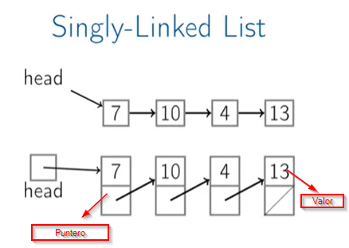
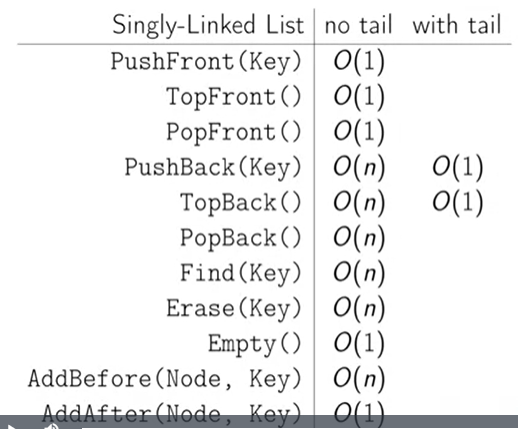

<h1>Estructuras de Datos</h1>

> Los ejemplos de código presentados en el siguiente archivo están hechos en JavaScript, pero la teoría es totalmente válida para cualquier lenguaje de programación.

> https://github.com/Leninner/coding-interview-university#data-structures

**ÍNDICE**

## Arrays

Es una área contigua de memoria que se compone de una serie de elementos del mismo tamaño posicionados de forma consecutiva numerados a través de números enteros. Esta numeración de posiciones empieza en 0.

Tenemos acceso de tiempo constante para cada elemento del array. Tiempo constante para leer y para escribir:

    - array_addr + elem_size * (i - first_index)

> Esto no lo hacemos nosotros, lo hace el compilador o intérprete por nosotros pero es importante saberlo

Las posiciones o los índices empiezan a partir de 0:

```javascript
const array = [10, 20, 30, 40, 50];

array[0]; // 10
array[1]; // 20
array[2]; // 30
array[3]; // 40
array[4]; // 50
```

Tenemos tiempo constante o **BigO(1)** para eliminar o añadir un elemento al final del arreglo y tiempo lineal o **BigO(n)** para añadir o eliminar elementos en una posición arbitraria.

- Los arreglos `dinámicos` son aquellos que pueden crecer o decrecer en runtime y no requieren una cantidad fija de elementos. Para Java sería un `ArrayList` o en C++ un `vector`.

- Los arreglos `estáticos` son aquellos que no pueden crecer o decrecer en runtime y requieren una cantidad fija de elementos. Para Java sería un `Array`.

> Los arreglos `irregulares` son aquellos conocidos como un arreglo de arreglos.

Algunos de los métodos aplicados sobre un arreglo son:

- Añadir un elemento al final del arreglo.
- Eliminar el último elemento del arreglo.
- Eliminar el primer elemento del arreglo.
- Añadir un elemento al inicio del arreglo.
- Eliminar o añade elementos en una posición arbitraria.
- Extraer una porción del arreglo.
- Devolver el tamaño del arreglo.
- Buscar un elemento en el arreglo.
- Ordenar un arreglo.
- Etc...

## Linked Lists

https://github.com/Leninner/coding-interview-university#data-structures

El concepto de Linked Lists aparecen por las problemáticas que se tienen al trabajar con `arreglos`:

1. Insertar o eliminar un elemento en una posición arbitraria, por ejemplo el inicio o el final del arreglo.
   Al insertar o eliminar un elemento en una posición arbitraria, se necesita mover todos los elementos que están después de esa posición, entonces el tiempo de ejecución aumenta mucho.

2. Los arreglos tienen un tamaño fijo

Los linked lists son un tipo de dato **recursivo**.

> La **recursividad** es una técnica de programación que busca resolver un problema sustituyéndolo por otros problemas de la misma categoría, pero más simples. Se dice que un algoritmo es recursivo si dentro del cuerpo del algoritmo y de forma directa o indirecta se realiza una llamada a él mismo.

### Singly Linked List

Una Singly Linked List es un tipo de Linked List que es `unidireccional`, es decir, que puede ser **atravesada en una sola dirección**, de la `cabeza hasta el último nodo`, llamado `tail`.

- El primer elemento de esta lista se llamada `head` y apunta hacia el primer nodo de la lista y nos ayuda a acceder a todos los otros elementos de la lista.

- Un `nodo` está compuesto por un `valor` y un `puntero` que apunta al siguiente nodo.

- El último nodo de la lista, llamado `tail` apunta a `null` y nos ayuda a saber cuándo terminamos de recorrer la lista.

  - head -> [node1 | ->] [node2 | ->] [node3 | ->] [tail | /]

Imagen de una lista singly linked list:



**Opetaciones que se pueden realizar en una Singly Linked List**

> Tomar en cuenta que la implementación de las operaciones pueden ser hechas de una forma o de otra, dependiendo del lenguaje de programación que se use.

- `PushFront(key)`: Añade el elemento `key` al inicio de la lista.
- `key TopFront()`: Devuelve el elemento que está en el inicio de la lista.
- `PopFront()`: Elimina el elemento que está en el inicio de la lista.
- `PushBack(key)`: Añade el elemento `key` al final de la lista. (Llamado también `append`).
- `ket TopBack()`: Devuelve el elemento que está en el final de la lista.
- `PopBack()`: Elimina el elemento que está en el final de la lista.
- `Boolean Find(key)`: is true if the list contains the element `key`.
- `Erase(key)`: Elimina el elemento `key` de la lista.
- `Boolean Empty()`: is true if the list is empty.
- `AddBefore(node, newKey)`: Añade el elemento `newKey` antes del `nodo`.
- `AddAfter(node, newKey)`: Añade el elemento `newKey` después del `nodo`.

Imagen con los tiempo en BigO de las operaciones de una Singly Linked List:



## Stacks

## Queues

## Hash Tables
