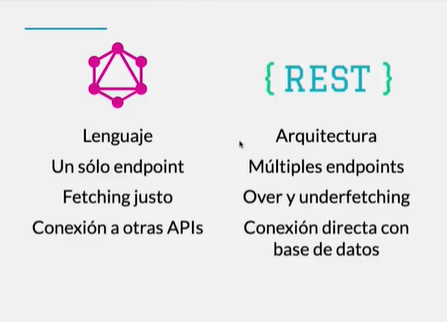

**ÍNDICE:**

- [Graph QL](#graph-ql)

# Graph QL

Es un lenguaje creado por facebook que nos permite recuperar los datos que necesitamos en nuestra aplicación.

- Nos permite describir nuestros datos
- Nos permite recuperar justo la información que necesitamos
- Obtendremos resultados predecibles

> Graph QL no sustituye a REST

