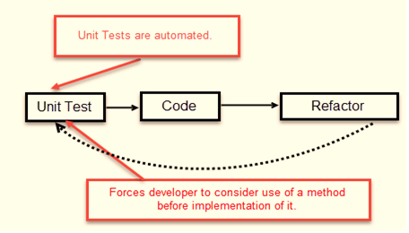
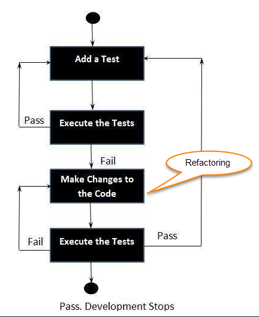
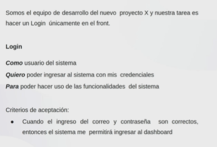
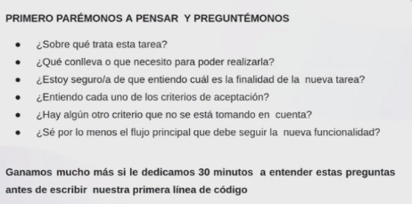
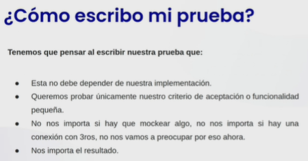
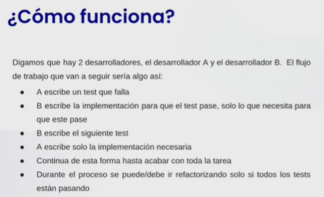
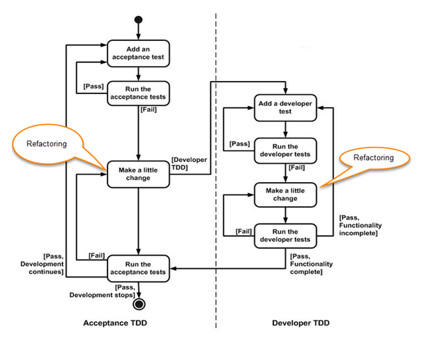
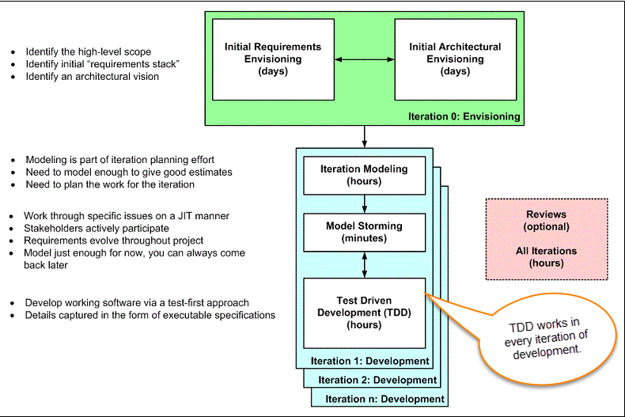

**ÍNDICE**

- [¿Qué es Test Driven Development? TDD](#qué-es-test-driven-development-tdd)
  - [¿Cómo realizar una prueba TDD?](#cómo-realizar-una-prueba-tdd)
  - [Preguntas que TDD responde](#preguntas-que-tdd-responde)
  - [Spike](#spike)
  - [Ping Pong Pair Programming](#ping-pong-pair-programming)
  - [TDD vs Testing Tradicional](#tdd-vs-testing-tradicional)
  - [¿Qué es TDD de aceptación y TDD de desarrollador?](#qué-es-tdd-de-aceptación-y-tdd-de-desarrollador)
  - [Escalar TDD a través del Agile Model Driven Development (AMDD)](#escalar-tdd-a-través-del-agile-model-driven-development-amdd)
    - [Iteración 0 - Envisioning](#iteración-0---envisioning)
    - [Iteration Modeling](#iteration-modeling)
    - [Model Storming (Just in time modeling)](#model-storming-just-in-time-modeling)
    - [Test Driven Development (TDD) vs Agile Model Driven Development (AMDD)](#test-driven-development-tdd-vs-agile-model-driven-development-amdd)
  - [Ventajas de TDD](#ventajas-de-tdd)
  - [Pilares fundamentales de TDD](#pilares-fundamentales-de-tdd)
  - [¿Por qué los desarrolladores deberían preocuparse por las pruebas unitarias automatizadas?](#por-qué-los-desarrolladores-deberían-preocuparse-por-las-pruebas-unitarias-automatizadas)
  - [¿Cómo lleva TDD el desarrollo al siguiente nivel?](#cómo-lleva-tdd-el-desarrollo-al-siguiente-nivel)
- [Instalación de Jest](#instalación-de-jest)
  - [Usando Matchers](#usando-matchers)
    - [Comparadores Comunes](#comparadores-comunes)
    - [Veracidad](#veracidad)
    - [Números](#números)
    - [Strings](#strings)
    - [Arrays and iterables](#arrays-and-iterables)
    - [Excepciones](#excepciones)
  - [Instalación de Babel para Jest](#instalación-de-babel-para-jest)
  - [Aislamiento](#aislamiento)
    - [¿Qué son funciones puras?](#qué-son-funciones-puras)
      - [¿Qué son los efectos secundarios observables?](#qué-son-los-efectos-secundarios-observables)
  - [Mocking](#mocking)
- [Pruebas asíncronas](#pruebas-asíncronas)

# ¿Qué es Test Driven Development? TDD

Es un **enfoque de desarrollo de software** en el que se desarrollan casos de prueba para especificar y validar `lo que hará el código.`

Se escribe primero el test, esperando que fallen las pruebas y luego se realiza el código para hacer que las pruebas finalmente pasen. Nos ayuda a hacer código simple y fácil de depurar.



> Se escriben tests que fallen, antes de escribir código nuevo.

A veces también se lo denomina **test first development TFD**

## ¿Cómo realizar una prueba TDD?

1. Añadimos un nuevo test
2. Correr todos los tests y verificar que los tests añadidos fallen
3. Escribir algo de código
4. Correr los tests y refactorizar el código
5. Repetir



Algunas clarificaciones sobre TDD:

- El enfoque TDD no se trata de `Pruebas` ni de `Diseño`.
- TDD no significa `escribir algunas de las pruebas, luego construir un sistema que pase las pruebas.`
- TDD no significa `hacer muchas pruebas`.

## Preguntas que TDD responde

- ¿Cómo hago el código?
- ¿Por dónde empiezo?
- ¿Cómo se lo que hay que implementar y lo que no?
- ¿Cómo escribir un código que se pueda modificar sin romper el código existente?

## Spike

¿Cómo hago TDD de algo totalmente nuevo y no sé como funciona?

Se debe hacer un **Spike**

Es tomarse un tiempo para investigar herramientas, librerías, conceptos, etc, con la finalidad de ganar conocimiento.

Por ejemplo: Al trabajar con una nueva API y no sabemos como hacerlo, podemos hacer un Spike para investigarla y analizar las respuestas que me entrega la API.

Otro ejemplo:



¿Qué debemos hacer primero?



> Debemos tener el flujo de la tarea bien definido.



## Ping Pong Pair Programming

Es una fusión entre TDD y Pair Programming.

- Se usa TDD
- Es fácil encontrar un ritmo para que el pair fluya
- Evita que los pares no coincidan, si un dev sabe más que otro
- El trabajo está gamificado



## TDD vs Testing Tradicional

- Con testing tradicional, al pasar un test se encuentra uno o más defectos. En TDD, al fallar un test, sabemos exactamente **qué necesitamos para resolver el problema**
- TDD **asegura** que tu sistema cumpla con los **requerimientos definidos para él**. Ayuda a construir confianza sobre el sistema.
- En TDD, se enfoca más en el código de producción que en el código de las pruebas. En Testing tradicional, se enfoca más en el diseño de las pruebas.
- En TDD se evalua el 100% de cobertura, a comparación del testing tradicional.
- La combinación de pruebas tradicionales y TDD lleva a la importancia de probar el sistema en lugar de perfeccionarlo.

## ¿Qué es TDD de aceptación y TDD de desarrollador?

1. `Acceptance TDD (ATDD):` Con esto, escribes una sola prueba de aceptación. Este test cumple con los requerimientos de las especificaciones o conportamientos del sistema. Esta prueba se basa en el comportamiento del sistema. Se conoce también como **Behavior Driven Development (BDD).**

2. `Developer TDD`: En este caso, se escriben varias pruebas unitarias para cada una de las pequeñas funcionalidades del sistema.

> Ambos casos usan JIT (Just In Time), que significa que vamos a cumplir con las pruebas que pruebas solo los requerimientos necesarios del sistema.



## Escalar TDD a través del Agile Model Driven Development (AMDD)

TDD es muy bueno en la especificación y validación detalladas pero no puede pensar en cuestiones más importantes, como el diseño general, el uso del sistema o la UI.

AMDD aborda los problemas de escalamiento ágil que TDD no aborda, `se usa para problemas más grandes.`

El ciclo de vida de AMDD:



`Envisioning`

- Es una parte del desarrollo TDD en donde se predicen/imaginan tests que serán desarrollados durante la primera semana del proyecto.
- El objetivo principal es analizar el alcance del sistema y su arquitectura
- En este proceso no se busca detallar las especificaciones del sistema. Se exploran los requerimientos del sistema, lo cuál nos da una estrategia general del proyecto.

### Iteración 0 - Envisioning

1. `Initial requirements envisioning`: Puede tomar varios días para identificar los **requisitos de alto nivel y el alcance** del sistema.
2. `Initial Architectural envisioning`: Puede tomar varios días para identificar la arquitectura del sistema.

### Iteration Modeling

Aquí el equipo planea el trabajo que será hecho durante cada iteración

- Un proceso ágil es usado para el diseño de las iteraciones.
- Se tomará en consideración el primer trabajo de mayor prioridad. Los elementos de trabajo agregados pueden volver a priorizarse o eliminarse de la pila de elementos en cualquier momento.
- El equipo discute cómo van a implementar cada requisito. El modelado se utiliza para este propósito.
- El análisis y diseño del modelado se realiza para cada requisito que se va a implementar para esa iteración.

### Model Storming (Just in time modeling)

Se realizan sesiones para identificar problemas en el modelado. Posteriomente, si se encontró un problema y se quiere solucionar, se realizan **stand-up modeling or customer QA sessions.**

### Test Driven Development (TDD) vs Agile Model Driven Development (AMDD)

- TDD acorta el ciclo de retroalimentación de programación
- AMDD acorta el ciclo de retroalimentación de modelado
- TDD es para espeficicaciones detalladas
- AMDD trabaja para grandes problemas
- TDD promueve el desarrollo de código de alta calidad.
- AMDD promueve alta calidad de comunicación con los stakeholders y developers.
- TDD habla a los developers
- AMDD bala a un analista de negocio, stakeholders y profesionales de datos.
- TDD orientado a la no visualización.
- AMDD oriendtado a la visualización.
- TDD tiene alance limitado a como el software funciona.
- AMDD tiene un amplio alcance que incluye a las partes interesadas. Se trata de trabajar hacia un entendimiento común
- Ambos soportan desarrollo evolucionado

## Ventajas de TDD

- Notificación temprana de bugs
- Código bien diseñado, limpio y más extensible
- Confianza al refactorizar
- Bueno para el trabajo en equipo
- Bueno para los desarrolladores

## Pilares fundamentales de TDD

- Se implementan las funciones justas que requiere el cliente y no más
- Minimización de defectos que llegan a producción
- Producción de software modular, flexible y escalable

## ¿Por qué los desarrolladores deberían preocuparse por las pruebas unitarias automatizadas?

¡Te mantiene fuera del depurador (hambriento de tiempo)!
Reduce errores en nuevas funciones y en funciones existentes.
Reduce el costo del cambio
Mejora el diseño
Fomenta la refactorización
Crea una red de seguridad para defenderse de otros programadores
Es divertido
Te obliga a reducir la velocidad y pensar
Acelera el desarrollo al eliminar el desperdicio
Reduce el miedo

## ¿Cómo lleva TDD el desarrollo al siguiente nivel?

Mejora la productividad al:

- Minimizando el tiempo dedicado a la depuración
- reduce la necesidad de verificación manual (mono) por parte de desarrolladores y tester ayudando a los desarrolladores a mantener el enfoque
- reducir el desperdicio: traspasos
- Mejora la comunicación
- Creación de especificaciones vivas y actualizadas
- Comunicar decisiones de diseño
- Aprendizaje: escucha tu código
- Pasos de bebé: disminuya la velocidad y piense
- Mejora la confianza
- Código comprobable por diseño + red de seguridad
- Diseño de acoplamiento flexible
- Refactorización

# Instalación de Jest

Para instalas Jest ejecutamos lo siguiente en la terminal:

```bash
npm i -D jest
```

Para instalar de manera global, utilizamos:

```bash
sudo npm install jest --global
```

## Usando Matchers

Jest usa "comparadores" para permitirle probar valores de diferentes maneras.

### Comparadores Comunes

Similitud exacta:

```js
test('two plus two is four', () => {
  expect(2 + 2).toBe(4);
});
```

En el ejemplo anterior, .toBe(4) es el Matcher
Si desea verificar el valor de un objeto, use toEqual en su lugar:

```js
test('object assignment', () => {
  const data = { one: 1 };
  data['two'] = 2;
  expect(data).toEqual({ one: 1, two: 2 });
});
```

toEqual comprueba de forma recursiva todos los campos de un objeto o matriz.
También puede probar lo opuesto a un comparador:

```js
test('adding positive numbers is not zero', () => {
  for (let a = 1; a < 10; a++) {
    for (let b = 1; b < 10; b++) {
      expect(a + b).not.toBe(0);
    }
  }
});
```

### Veracidad

A veces necesitamos ver si algo es null, undefined o false. Jest nos ayuda con eso:

- toBeNull matches only null
- toBeUndefined matches only undefined
- toBeDefined is the opposite of toBeUndefined
- toBeTruthy matches anything that an if statement treats as true
- toBeFalsy matches anything that an if statement treats as false

Ejemplo:

```js
test('null', () => {
  const n = null;
  expect(n).toBeNull();
  expect(n).toBeDefined();
  expect(n).not.toBeUndefined();
  expect(n).not.toBeTruthy();
  expect(n).toBeFalsy();
});

test('zero', () => {
  const z = 0;
  expect(z).not.toBeNull();
  expect(z).toBeDefined();
  expect(z).not.toBeUndefined();
  expect(z).not.toBeTruthy();
  expect(z).toBeFalsy();
});
```

### Números

Feature muy conveniente:

```js
test('two plus two', () => {
  const value = 2 + 2;
  expect(value).toBeGreaterThan(3);
  expect(value).toBeGreaterThanOrEqual(3.5);
  expect(value).toBeLessThan(5);
  expect(value).toBeLessThanOrEqual(4.5);

  // toBe and toEqual are equivalent for numbers
  expect(value).toBe(4);
  expect(value).toEqual(4);
});
```

Para la igualdad de punto flotante, use toBeCloseTo en lugar de toEqual, porque no desea que una prueba dependa de un pequeño error de redondeo.

```js
test('adding floating point numbers', () => {
  const value = 0.1 + 0.2;
  //expect(value).toBe(0.3);           This won't work because of rounding error
  expect(value).toBeCloseTo(0.3); // This works.
});
```

### Strings

Puede comparar cadenas con expresiones regulares con toMatch:

```js
test('there is no I in team', () => {
  expect('team').not.toMatch(/I/);
});

test('but there is a "stop" in Christoph', () => {
  expect('Christoph').toMatch(/stop/);
});
```

### Arrays and iterables

Puede verificar si una matriz o iterable contiene un elemento en particular usando toContain:

```js
const shoppingList = ['diapers', 'kleenex', 'trash bags', 'paper towels', 'milk'];

test('the shopping list has milk on it', () => {
  expect(shoppingList).toContain('milk');
  expect(new Set(shoppingList)).toContain('milk');
});
```

### Excepciones

Si desea probar si una función en particular arroja un error cuando se llama, use toThrow.

```js
function compileAndroidCode() {
  throw new Error('you are using the wrong JDK');
}

test('compiling android goes as expected', () => {
  expect(() => compileAndroidCode()).toThrow();
  expect(() => compileAndroidCode()).toThrow(Error);

  // You can also use the exact error message or a regexp
  expect(() => compileAndroidCode()).toThrow('you are using the wrong JDK');
  expect(() => compileAndroidCode()).toThrow(/JDK/);
});
```

## Instalación de Babel para Jest

Jest no reconoce la manera de importar de ES6, por esa razón debemos instalar Babel:

```bash
npm i -D @babel/preset-env
```

Archivo .babelrc para configuración:

```js
{ "presets": ["@babel/preset-env"] }
```

## Aislamiento

Solo debe probar un método a la vez, y sus pruebas para una función no deben depender de que una función externa se comporte correctamente, especialmente si esa función se está probando en otro lugar.

La razón principal de esto es que cuando sus pruebas fallan, desea poder delimitar la causa de esta falla lo más rápido posible. Si tiene una prueba que depende de varias funciones, puede ser difícil saber exactamente qué está fallando.

### ¿Qué son funciones puras?

1. La función siempre devuelve el mismo resultado si se pasan los mismos argumentos. No depende de ningún cambio de estado o de datos durante la ejecución de un programa. Solo debe depender de sus argumentos de entrada.

2. La función no produce ningún efecto secundario observable, como solicitudes de red, dispositivos de entrada y salida o mutación de datos.

#### ¿Qué son los efectos secundarios observables?

- Es cualquier interacción con el mundo exterior desde dentro de una función. Eso podría ser cualquier cosa, desde cambiar una variable que existe fuera de la función, hasta llamar a otro método desde dentro de una función.

NOTE: Si una función pura llama a una función pura, esto no es un efecto secundario y la función que llama sigue siendo pura.

Los efectos secundarios incluyen, entre otros:

- Hacer una solicitud HTTP
- Mutando datos
- Imprimir en una pantalla o consola
- Consulta / manipulación DOM
- Math.random ()
- Obtener la hora actual

> En sí mismos no son malos y a menudo son necesarios.

No todas las funciones deben ser puras

Ejemplo de función pura:

```js
function priceAfterTax(productPrice) {
  return productPrice * 0.2 + productPrice;
}
```

Ejemplo de función impura:

```js
let tax = 20;
function calculateTax(productPrice) {
  return productPrice * (tax / 100) + productPrice;
}
```

NOTE: Uno de los beneficios más grandes de usar funciones puras es que son testeables.

## Mocking

Hay dos soluciones al problema del `"código estrechamente acoplado"`:

1. The first, and best option is to simply remove those dependencies from your code as we did above, but that is simply not always possible.
2. La segunda opción es Mocking: escribir versiones "falsas" de una función que siempre se comporta exactamente como usted quiere. Por ejemplo en el uso de inputs por parte del usuario.

Un Unit es un módulo, componente o función. Unit test hace tests de ese módulo, componente o función.

Las afirmaciones de pruebas simples proporcionan:

- Mejor legibilidad.
- Menos código.
- Menos mantenimiento.

# Pruebas asíncronas

Para hacer pruebas asíncronas con promesas debemos hacer lo siguiente:

- Al cada test se le pasa un callback llamado `done` que le va a indicar a jest que en ese punto terminamos la prueba asíncrona y no tiene que evaluar más.

```js
import { getHeroeByIdAsync } from '../base/09-promesas';
import heroes from '../data/Heroes';

describe('Funciones asíncronas', () => {
  test('Debe retornar un heroe por ID async', (done) => {
    const id = 1;

    getHeroeByIdAsync(id).then((heroe) => {
      expect(heroe).toBe(heroes[0]);
      done();
    });
  });

  test('Error si el heroe no existe', (done) => {
    const id = 10;

    getHeroeByIdAsync(id).catch((error) => {
      // eslint-disable-next-line jest/no-conditional-expect
      expect(error).toBe('No se pudo encontrar el héroe');
      done();
    });
  });
});
```

También se puede utilizar `async` y `await`:

```js
import { getImagen } from '../base/11-async-await';

describe('Async and await', () => {
  test('Debe retornar el URL de una imagen', async () => {
    const url = await getImagen();

    console.log(url);

    expect(url.includes('https')).toBe(true);
  });
});
```
