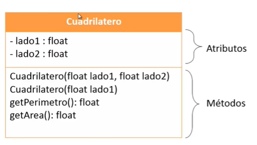
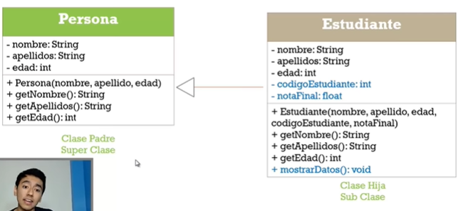
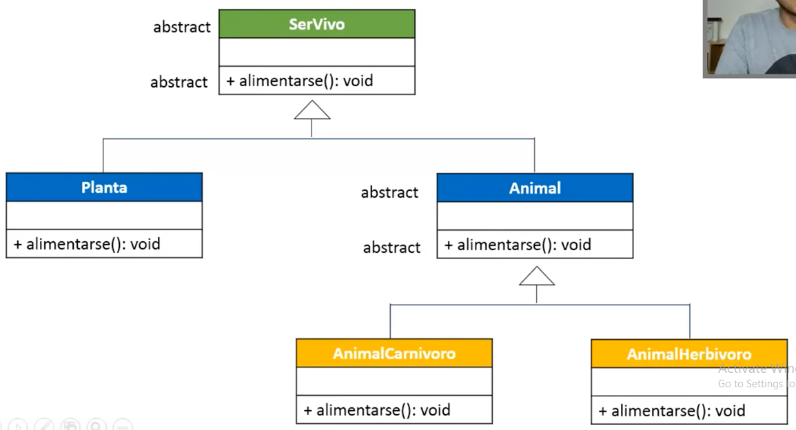
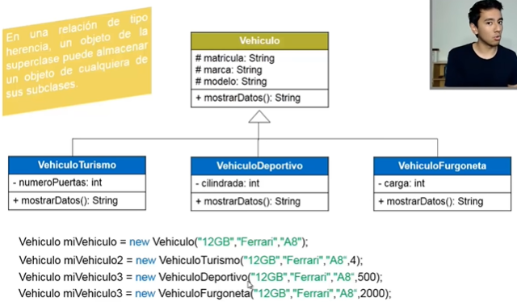
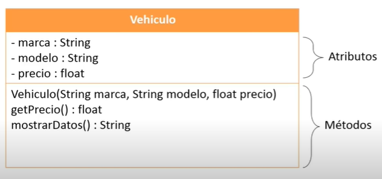
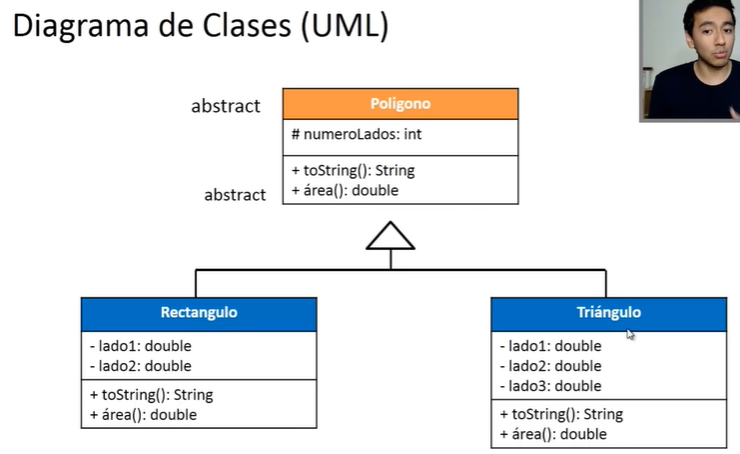

**Índice**

- [Conceptos Básicos de POO](#conceptos-básicos-de-poo)
  - [**¿Cómo se piensa en Objetos?**](#cómo-se-piensa-en-objetos)
  - [**¿Qué son las clases en POO?**](#qué-son-las-clases-en-poo)
  - [¿Qué es un **package**?](#qué-es-un-package)
- [Creación de clases y objetos en Java con Visual Studio Code](#creación-de-clases-y-objetos-en-java-con-visual-studio-code)
  - [Creando clases en Java](#creando-clases-en-java)
  - [Creando instancias u objetos de clases](#creando-instancias-u-objetos-de-clases)
- [Métodos en Java](#métodos-en-java)
  - [Parámetros y argumentos](#parámetros-y-argumentos)
  - [Retorno de valores](#retorno-de-valores)
  - [Usando los métodos](#usando-los-métodos)
  - [Método Constructor](#método-constructor)
    - [Inicialización de atributos a través del método constructor](#inicialización-de-atributos-a-través-del-método-constructor)
  - [Sobrecarga de Métodos](#sobrecarga-de-métodos)
- [Modificadores de Acceso](#modificadores-de-acceso)
  - [Tipos de Modificadores de Acceso](#tipos-de-modificadores-de-acceso)
- [Encapsulamiento y métodos accesores (Getters y Setters)](#encapsulamiento-y-métodos-accesores-getters-y-setters)
  - [Encapsulamiento](#encapsulamiento)
  - [Métodos Accesores (Getters y Setters)](#métodos-accesores-getters-y-setters)
- [Constantes](#constantes)
- [Miembros estáticos de una clase](#miembros-estáticos-de-una-clase)
- [Diagrama de Clases (UML)](#diagrama-de-clases-uml)
- [Herencia en Programación Orientada a Objetos](#herencia-en-programación-orientada-a-objetos)
- [Sobreescritura de miembros](#sobreescritura-de-miembros)
- [Clases y métodos abstractos](#clases-y-métodos-abstractos)
- [Polimorfismo](#polimorfismo)
- [Tratamiento de Excepciones](#tratamiento-de-excepciones)
- [Ejercicios de Lógica](#ejercicios-de-lógica)

# Conceptos Básicos de POO

Es una forma especial de programar, es más cercana a como se expresan los **objetos** en la vida real.

> Un objeto tiene atributos (características) y métodos (acciones que puede realizar ese objeto)

## **¿Cómo se piensa en Objetos?**

- Un objeto es aquel que tiene `atributos`, características o propiedades y también `métodos`, acciones, comportamientos o funciones que pueden ser ejecutadas sobre él.

## **¿Qué son las clases en POO?**

Una clase en POO es una plantilla que se utiliza para crear objetos. Podemos pensar en las clases como Fábricas de objetos.

- Una clase va a empezar con **mayúscula** y siempre se va a estar nombrada en **singular**.
- `Un objeto **se crea** a partir de una clase.` Se puede crear cualquier cantidad de objetos que se requieran.

## ¿Qué es un **package**?

Es un **conjunto de clases** que están relacionadas. En un proyecto pueden haber muchos `packages` y en un `package` pueden haber muchas clases.

- Ejemplo de clase llamada **coche** en un `package` llamado **ClasesYMetodos**

```java
// Esta línea nos dice a qué `package` pertenece esta clase
package ClasesYMetodos;

public class Coche {
  // Atributos
  String color;
  String marca;
  int km;

  // Métodos
  public void arrancarCoche() {
    System.out.println("Arrancando el coche");
  }

  public void acelerarCoche() {
    km += 10;
  }

  public void frenarCoche() {
    km -= 10;
  }

  public void mostrarKm() {
    System.out.println("El coche tiene " + km + " km");
  }
}
```

# Creación de clases y objetos en Java con Visual Studio Code

## Creando clases en Java

Para crear una clase en Java vamos a tener una sintaxis similar a esta:

1. Primero se define el modificador de acceso (public, private, protected)
2. Se añade la palabra reservada `class`
3. Se añade el nombre de la clase con `PascalCase`.

> Hay que tener en cuenta que el nombre de la clase debe ser único en el proyecto y además tiene que tener el mismo nombre que el archivo en que está definida

- NombreClase.java

```java
public class NombreClase {
    // ...
}
```

## Creando instancias u objetos de clases

Para instanciar un objeto a partir de una clase, se utiliza la palabra reservada `new` y se añade el nombre de la clase.

> La instanciación de objetos es similar a la creación de variables.

```java
NombreClase nombreObjeto = new NombreClase(params);
NombreClase nombreObjetoTwo = new NombreClase(params);
```

# Métodos en Java

Son acciones o comportamientos que realizan los objetos.

Para poder crearlos:

1. Declaramos el tipo de **modificador de acceso** (public, private, protected). Se puede leer acerca de modificadores de acceso en [Modificadores de Acceso](#modificadores-de-acceso)
2. Definimos el tipo de retorno del **método** (void, int, String, etc...). Se puede leer acerca de tipos de retorno en [Retorno de Valores](#retorno-de-valores)
3. Se define el nombre del método. Se recomiento utilizar verbos en infinitivo y utilizar `camelCase`

- Ejemplo:

```java
public void arrancarCoche() {
  System.out.println("Arrancando el coche");
  // ...
}
```

Al compilar el proyecto, el IDE va a leer el método `main` y va a ejecutar las instrucciones que le hayamos pasado:

- Ejemplo instanciando la clase `Coche` dentro de otra clase llamada `Main`

```java
package POO.src.ClasesYMetodos;

public class Main {
  public static void main(String[] args) {
    // Instancia 1
    Coche c1 = new Coche();

    // Propiedades
    c1.color = "Rojo";
    c1.marca = "Ferrari";
    c1.km = 0;

    // Métodos
    c1.arrancar();
    c1.acelerar();

    // Instancia 2
    Coche c2 = new Coche();

    // Propiedades
    c2.color = "Azul";
    c2.marca = "Audi";
    c2.km = 0;

    // Métodos
    c2.arrancar();
    c2.acelerar();
  }
}
```

## Parámetros y argumentos

- **Parámetros**: Es una declaración de variable o declaración de variable que se va a usar en un método.
- **Argumentos**: Son los valores que se pasan a un método.

Para crear un parámetro en un método:

- Debemos definir el tipo de dato que va a recibir el parámetro (String, int, etc...)
- Además debemos darle un nombre al parámetro

```java
// Declaración del método arrancar.
// Parámetros: String color, String marca

public void arrancar(String color, String marca) {
  System.out.println("Arrancando el coche de color " + color + " y marca " + marca);
}

// Invocación de un objeto.
// Argumentos: "Rojo", "Ferrari"
Objeto.arrancar("Rojo", "Ferrari");
// Output: Arrancando el coche de color Rojo y marca Ferrari
```

## Retorno de valores

Pensemos en un método como una pequeña fábrica, que ejecuta acciones y al final me devuelve un producto. Por ejemplo: Una fábrica que hace helados me va a retornar un helado.

Los métodos, al igual que una fábrica, nos van a retornar algo.

Existen distintos tipos de retorno:

- **int**: Retorna un número entero.
- **double**: Retorna un número decimal.
- **String**: Retorna una cadena de texto.
- **String[]**: Retorna un array de cadenas de texto.
- **int[]**: Retorna un array de números enteros.
- **char**: Retorna un carácter.
- **boolean**: Retorna un valor booleano.

- Ejemplo de creación de métodos con distintos tipos de retorno:

```java
// Método que va a retornar un número entero.
public int sumar(int numberOne, int numberTwo) {
  return numberOne + numberTwo;
}

// Método que va a retornar un número decimal.
public double sumar(double numberOne, double numberTwo) {
  return numberOne + numberTwo;
}

// Método que va a retornar una cadena de texto.
public String saludar(String nombre, String apellido) {
  return "Hola " + nombre + " " + apellido;
}

// Método que retornar un arreglo de números enteros.
public int[] sumar(int numberOne, int numberTwo) {
  int[] result = {numberOne, numberTwo};
  return result;
}

// Método que retornar un arreglo de cadenas de texto.
public String[] saludar(String nombreUno, String nombreDos) {
  return new String[] {nombreUno, nombreDos};
}
```

## Usando los métodos

Al crear un nuevo objeto a partir de una clase, todos los atributos y métodos de la clase se copian en el objeto, y tenemos acceso a ellos a través del objeto.

Vamos a crear un objeto de la clase `Coche` y usar algunos de sus métodos.

- Coche.java

```java
public class Coche {
    public String color;
    public String marca;
    public int km;

    public void arrancar() {
        System.out.println("Arrancando el coche");
    }

    public void acelerar() {
        System.out.println("Acelerando el coche");
    }

    public void frenar() {
        System.out.println("Frenando el coche");
    }

    public void estacionar() {
        System.out.println("Estacionando el coche");
    }

    public void girar() {
        System.out.println("Girando el coche");
    }

    public void acelerarVariasVeces(int veces) {
        for (int i = 0; i < veces; i++) {
            acelerar();
        }
    }
}
```

1. Creamos un objeto de la clase `Coche`

- Main.java

```java
public class Main {
  public static void main(String[] args) {
    Coche carroUno = new Coche();
  }
}
```

2. Usamos los métodos del objeto, que están definidos en la clase `Coche`

> Para poder usar los métodos del objeto, debemos escribir el nombre del objeto, seguido de un punto (.) y escribir el nombre del método.

```java
public class Main {
  public static void main(String[] args) {
    Coche carroUno = new Coche();
    carroUno.arrancar(); // Uso del método arrancar
    carroUno.acelerar(); // Uso del método acelerar
    carroUno.acelerarVariasVeces(3); // Uso del método acelerarVariasVeces
  }
}
```

## Método Constructor

Es un método especial de una clase, que se invoca siempre y automáticamente al momento en que se **crea un objeto de una clase**.

**Características:**

1. Tienen el mismo nombre de la clase
2. No devuelven nada
3. Debe declararse como `public`
4. No se le debe poner un valor de retorno, ni siquiera `void`

**Cuando se crea un objeto ocurren 3 cosas:**

1. Se asigna memoria para el objeto.
2. Se inicializan los atributos de ese objeto
3. Se invoca al constructor de la clase que puede ser uno entre varios

- Ejemplo:

```java
// Método Constructor en la clase Coche

public class Coche {
    public Coche() {
        System.out.println("Creando un coche");
    }
}

// Uso del método Constructor. Es lo que va seguido a la palabra clave `new`.
Coche cocheUno = new Coche();
```

### Inicialización de atributos a través del método constructor

Para inicializar un atributo, existen dos formas:

- **Primer caso:** Los **parámetros** del `método constructor` tienen nombre distintos a los atributos de la clase.

```java
public class Coche {
    //Atributos de la clase
    public String color;
    public String marca;
    public int km;

    // Método Constructor
    public Coche(String _nombre, String _color, int _km) {
        color = _color;
        marca = _nombre;
        km = _km;
    }
}
```

- **Segundo caso:** Los parámetros del constructor tienen el mismo nombre que los atributos de la clase.

```java
public class Coche {
    //Atributos de la clase
    public String color;
    public String marca;
    public int km;

    // Método Constructor
    public Coche(String nombre, String color, int km) {
        this.color = color;
        this.marca = nombre;
        this.km = km;
    }
}
```

> `this` es una palabra reservada que le indica a Java que ese atributo es el mismo que el atributo de la clase.

Para instanciar un nuevo objeto, debemos pasarle los parámetros que se le pasan al constructor en orden y con los mismos tipos de datos.

```java
public class Main {
    public static void main(String[] args) {
        Coche cocheUno = new Coche("Ford", "Rojo", 100);
        Coche cocheDos = new Coche("Fiat", "Azul", 200);
        Coche cocheTres = new Coche("Renault", "Verde", 300);
    }
}
```

## Sobrecarga de Métodos

En el ámbito de la POO, la sobrecarga de métodos se refiere a la posibilidad de tener dos o más métodos con el mismo nombre pero distinta funcionalidad.

Cuando escribimos más de un método con el mismo nombre, pero con distintos parámetros, podemos decir que es una sobrecarga de método.

Es decir, dos o más métodos con el mismo nombre realizan acciones diferentes y el compilador usará una u otra dependiendo de los parámetros usados.

Esto también se aplica a los constructores (es la aplicación más habitual de la sobrecarga).

Ejemplo:

```java
// Método arrancar
public void arrancar(String color, String marca) {
  System.out.println("Arrancando el coche de color " + color + " y marca " + marca);
}

// Otro método arrancar
public void arrancar(String color, String marca, int km) {
  System.out.println("Arrancando el coche de color " + color + " y marca " + marca + " con " + km + " km");
}

// Otro método arrancar
public void arrancar(String color, String marca, int km, String combustible) {
  System.out.println("Arrancando el coche de color " + color + " y marca " + marca + " con " + km + " km y " + combustible);
}
```

**Java** detecta que hay más de un método con el mismo nombre, pero sabe que son métodos sobrecargados por los tipos de datos de los parámetros y también la cantidad de parámetros que tenga cada método.

Otros ejemplos de la sobrecarga de métodos:

```java
// Método saludar
public String saludar(String nombre) {
  return "Hola " + nombre;
}

// Otro método saludar sobrecargado
public String saludar(String nombre, String apellido) {
  return "Hola " + nombre + " " + apellido;
}

// Otro método saludar con la misma cantidad de parámetros pero con distintos tipos de datos
public String saludar(String nombre, int edad) {
  return "Hola " + nombre + " tu edad es " + edad;
}
```

Ejemplos con sobrecarga de métodos constructores:

```java
// Método Constructor
public Coche(String _nombre, String _color, int _km) {
  color = _color;
  marca = _nombre;
  km = _km;
}

// Método Constructor sobrecargado
public Coche(String nombre, String color, int km, String combustible) {
  this.color = color;
  this.marca = nombre;
  this.km = km;
  this.combustible = combustible;
}
```

# Modificadores de Acceso

Es una palabra especial que va antes de la definición de un atributo o de un método y nos va a servir para conocer cuál es la visibilidad de ese atributo o método respecto a otras clases o paquetes.

Cuando dejamos la declaración de un atributo o método por defecto, es decir, sin especificar el modificador de acceso, va a ser visible para **todas las clases dentro de ese paquete, pero no para clases de otros paquetes**:

Ejemplo:

- Clase1.java (PaqueteUno)

```java
package PaqueteUno;

public class Clase1 {
  // Atributo
  int atributo1;
}
```

- Clase2.java (PaqueteUno)

```java
package PaqueteUno;

public class Clase2 {
  public static void main(String[] args) {
    Clase1 objeto1 = new Clase1();

    objeto1.atributo1 = 15; // Funciona correctamente y sin errores
  }
}
```

- Clase3.java (PaqueteDos)

> Para crear un objeto de un paquete, dentro de otro, debemos importarlo

```java
package PaqueteDos;

import PaqueteUno.Clase1; // Importamos la clase Clase1 de PaqueteUno

public class Clase3 {
  public static void main(String[] args) {
    Clase1 objeto1 = new Clase1();

    objeto1.atributo1 = 15; // Salta un error que nos dice que ese atributo no está visible.
  }
}
```

Para solucionar el problema de la Clase3 vamos a hacer el atributo de la clase Clase1 público con la palabra **public**:

- Clase1.java (PaqueteUno)

```java
package PaqueteUno;

public class Clase1 {
  public int atributo1;
}
```

Al hacer eso, ya podemos acceder a ese atributo desde cualquier clase y desde cualquier paquete.

## Tipos de Modificadores de Acceso

- **public**: Se usa para declarar un atributo o método público, el cuál va a ser accesible desde cualquier clase o paquete.
- **protected**: Se usa para declarar un atributo o método protegido, el cuál va a ser accesible desde cualquier clase o paquete, y además desde clases hijas, pero no desde clases ajenas y de otros paquetes.
- **private**: Se usa para declarar un atributo o método privado, el cuál va a ser accesible sólo desde la clase en la que está definido.
- **default**: Se usa para declarar un atributo o método por defecto, el cuál va a ser accesible desde cualquier clase del mismo paquete, pero no desde otro paquete.

# Encapsulamiento y métodos accesores (Getters y Setters)

## Encapsulamiento

El encapsulamiento es una técnica que nos permite ocultar los detalles, atributos o métodos de la clase, para que solo puedan ser accedidos desde esa misma clase y no cualquiera pueda modificar esos atributos o métodos a su antojo, sino más bien, a través de **métodos accesores.**

Ejemplo de encapsulamiento (ocultar atributos o métodos de la clase):

```java
package PaqueteUno;

public class Clase1 {
  private int atributo1;
}
```

## Métodos Accesores (Getters y Setters)

Para poder acceder a estos atributos y métodos encapsulados, desde otras clases, vamos a utilizar los métodos accesores (Getters y Setters).

Ejemplo:

```java
  private int edad;

  // Método getter
  public int getEdad() {
    return edad;
  }

  // Método setter
  public void setEdad(int edad) {
    this.edad = edad;
  }
```

- Un **método getter** es un método que nos va a permitir obtener el valor de un atributo, y que va a ser llamado desde otras clases.
- Un **método setter** es un método que nos va a permitir modificar el valor de un atributo, y que va a ser llamado desde otras clases.

# Constantes

Espacio de memoria en donde se almacena algún valor, y ese valor no va a variar en ningún momento.

Para crear una constante, debemos usar la palabra **final**:

```java
final int constante1 = 15;
public final int constante2 = 15;
private final int constante3 = 15;
```

Ejemplo en una clase:

```java
package PaqueteUno;

public class Clase1 {
  private final String nombre;
  private int edad;

  public Clase1(String nombre) {
    this.nombre = nombre;
  }

  public int getEdad() {
    return edad;
  }

  public void setEdad(int edad) {
    this.edad = edad;
  }

  public String getNombre() {
    return nombre;
  }
}
```

# Miembros estáticos de una clase

Son métodos o atributos que **no pertenecen a un objeto, sino a la clase misma.**

Al crearse un nuevo objeto de una clase, se crean copias de los métodos y atributos **no** estáticos de la clase. Esto se debe a que **los métodos y atributos no estáticos son atributos o métodos de objetos,** y no de la clase misma.

Un `atributo o método estático` va a ser accesible desde cualquier clase, pero no desde un objeto.

> Se hace uso de la palabra reservada **static**

Ejemplo:

- **Método estático**:

```java
package PaqueteUno;

  public class Clase1 {
    public static void metodoEstatico() {
      System.out.println("Método estático");
    }
  }
```

- **Atributo estático**:

```java
  public class Clase1 {
    public static int atributoEstatico;
  }
```

Ejemplo de uso:

```java
package PaqueteUno;

public class Static {
    private static String frase2 = "Segunda frase";

    public static void main(String[] args) {
        Static objeto = new Static();
        Static objeto2 = new Static();

        objeto.frase2 = "Cambio de frase";

        System.out.println(objeto.frase2); // Cambio de frase
        System.out.println(objeto2.frase2); // Cambio de frase
    }
}
```

Otra forma de utilizar:

```java
package PaqueteUno;

public class Static {
    static String frase2 = "Segunda frase";

    public static void main(String[] args) {
        System.out.println(Static.frase2); // Segunda frase
    }
}
```

# Diagrama de Clases (UML)

Nos va a ayudar en la organización de clases.



- Se usa el menos (-) para atributos y métodos privados.
- Se usa el # para atributos y métodos protegidos.
- Se usa la palabra `abstract` para declarar un método abstracto.
- Se usa la palabra `static` para declarar un atributo o método estático.
- Se debe añadir el tipo de atributo

# Herencia en Programación Orientada a Objetos

Forma de reutilización de software, en la que se crea una nueva clase al absorber los parámetros y métodos de una ya existente.



Tenemos una clase padre o superclase:

```java
package Herencia;

public class Persona {
    private String nombre;
    private String apellido;
    private int edad;

    public Persona(String nombre, String apellido, int edad) {
        this.nombre = nombre;
        this.apellido = apellido;
        this.edad = edad;
    }

    public String getNombre() {
        return nombre;
    }

    public String getApellido() {
        return apellido;
    }

    public int getEdad() {
        return edad;
    }
}
```

Y una clase hija o subclase:

```java
package Herencia;

public class Estudiante extends Persona {
    int codigoEstudiante;
    double notaFinal;

    public Estudiante(String nombre, String apellido, int edad, int codigoEstudiante, double notaFinal) {
        super(nombre, apellido, edad);
        this.codigoEstudiante = codigoEstudiante;
        this.notaFinal = notaFinal;
    }
}
```

Hacemos uso de la palabra clase `extends` para indicar que la clase hija hereda de la clase padre.

En el constructor de la subclase debemos llamar al constructor de la superclase a través de la palabra `super` para obtener los parámetros de la clase padre.

> La keyword `super` se usa para referirse a una variable local en un método y a una variable de la superclase que tiene el mismo nombre

La llamada a super() se realiza en la subclase y debe ser la primera instrucción del constructor de la clase hija.

# Sobreescritura de miembros

No es igual a sobrecarga de miembros o métodos. Es una forma de sobreescribir un mismo método en distintas clases.
Se utiliza bastante en la herencia.

- Clase padre `Animal`:

```java
package Herencia;

public class Animal {
    public void comer() {
        System.out.println("Animal comiendo");
    }
}
```

- Clase hija `Perro`:

```java
package Herencia;

public class Perro extends Animal {
  // Se puede escribir @Override para indicar que se debe sobreescribir el método. Dependiendo la versión del JDK, el compilador puede o no mostrar el error.
    public void comer() {
        System.out.println("Perro comiendo");
    }
}
```

- Clase hija `Vaca`:

```java
package Herencia;

public class Vaca extends Animal {
  // Se puede escribir @Override para indicar que se debe sobreescribir el método. Dependiendo la versión del JDK, el compilador puede o no mostrar el error.
    public void comer() {
        System.out.println("Vaca comiendo");
    }
}
```

# Clases y métodos abstractos

Clase Abstracta:

- Se utiliza solo como superclase o clase padre.
- No se pueden instanciar objetos
- Sirve para proporcionar una super clase apropiada a partir de la cuál heredan otras clases

Métodos abstractos:

- Van a ser métodos que se encuentran en superclases o clases padre.
- Sirven para definir una función que debe ser implementada en las subclases, pero no se sabe como implementarla correctamente.
- Al tener un método abstracto, la clase también debe ser abstracta.
- Estos métodos deben ser sobreescritos SI o SI en al menos una subclase.

Gráfico de ejemplo:



SerVivo.java

```java
package Abstract;

public abstract  class SerVivo {
    public abstract void alimentarse();
}
```

Planta.java

```java
package Abstract;

public class Planta extends SerVivo {
    // Tenemos que sobreescribir el método alimentarse
    public void alimentarse() {
        System.out.println("La planta se alimenta de nutrientes");
    }
}
```

Animal.java

```java
package Abstract;

public abstract class Animal extends SerVivo {
    public abstract void alimentarse();
}
```

Hervivoro.java

```java
package Abstract;

public class Hervivoro extends Animal {
    public void alimentarse() {
        System.out.println("El hervivoro se alimenta de carne");
    }
}
```

Main.java

```java
package Abstract;

public class Main {
    public static void main(String[] args) {
        Carnivoro c = new Carnivoro(); // Its work
        System.out.println(c.alimentarse());
    }
}
```

# Polimorfismo

En una relación de tipo herencia, un objeto de la superclase puede almacenar un objeto de cualquiera de sus subclases.

La clase padre es compatible con los tipos que derivan de ella. Pero no al revés.

- Una clase padre, puede instanciar objetos de clases hijas, pero no viceversa.

- `Poli` => Muchos
- `Morfismo` => Forma

**Polimorfismo** => Las muchas formas que puede tomar un objeto depende el contexto en dónde se utilice

> Los objetos de tipo de la clase padre pueden ser instancias a través de cualquiera de sus subclases



Vehiculo.java

```java
package Polimorfismo;

public class Vehiculo {
    protected String marca;
    protected String matricula;
    protected String modelo;

    public Vehiculo(String marca, String matricula, String modelo){
        this.marca = marca;
        this.matricula = matricula;
        this.modelo = modelo;
    }

    public String getMarca(){
        return marca;
    }

    public String getMatricula() {
        return matricula;
    }

    public String getModelo() {
        return modelo;
    }

    public String mostrarDatos() {
        return "Marca: " + marca + "\nMatricula: " + matricula + "\nModelo: " + modelo;
    }
}
```

VehiculoDeportivo.java

```java
package Polimorfismo;

public class VehiculoDeportivo extends Vehiculo {
    private int cilindrada;

    public VehiculoDeportivo(String marca, String matricula, String modelo, int cilindrada) {
        super(marca, matricula, modelo);
        this.cilindrada = cilindrada;
    }

    public String mostrarDatos() {
        return super.mostrarDatos() + "\nCilindrada: " + cilindrada;
    }
}
```

VehiculoFurgoneta.java

```java
package Polimorfismo;

public class VehiculoFurgoneta extends Vehiculo {
    private int carga;

    public VehiculoFurgoneta(String marca, String matricula, String modelo, int carga) {
        super(marca, matricula, modelo);
        this.carga = carga;
    }

    public String mostrarDatos() {
        return super.mostrarDatos() + "\nCarga: " + carga;
    }
}
```

VehiculoTurismo.java

```java
package Polimorfismo;

public class VehiculoTurismo extends Vehiculo {
    private int nPuertas;

    public VehiculoTurismo(String marca, String matricula, String modelo, int nPuertas) {
        super(marca, matricula, modelo);
        this.nPuertas = nPuertas;
    }

    public String mostrarDatos() {
        return super.mostrarDatos() + "\nNumero de puertas: " + nPuertas;
    }
}
```

Main.java

```java
package Polimorfismo;

public class Main {
    public static void main(String[] args) {
        Vehiculo[] misVehiculos = new Vehiculo[4];

        misVehiculos[0] = new Vehiculo("Ford", "ABC123", "Focus");
        misVehiculos[1] = new VehiculoDeportivo("Ferrari", "DEF456", "F40", 488);
        misVehiculos[2] = new VehiculoFurgoneta("Seat", "GHI789", "Ibiza", 5);
        misVehiculos[3] = new VehiculoTurismo("Renault", "JKL012", "Megane", 5);

        for (int i = 0; i < misVehiculos.length; i++) {
            System.out.println(misVehiculos[i].mostrarDatos() + "\n");
        }
    }
}
```

# Tratamiento de Excepciones

Una **exepción** es una situación que puede ocurrir en un programa. Por ejemplo, si se intenta acceder a una posición de un arreglo que no existe.

# Ejercicios de Lógica

1. Crear un programa que calcule el área y perímetro de un cuadrilátero.

 

Cuadrilatero.java:

```java
public class Cuadrilatero {
  // Atributos
  private float lado1;
  private float lado2;

    // Constructor 1 (Cuadrilátero)
    public Cuadrilatero(float lado1, float lado2){
        this.lado1 = lado1;
        this.lado2 = lado2;
    }

    // Constructor 2 (Cuadrado)
    public Cuadrilatero(float lado1) {
        this.lado1 = this.lado2 = lado1;
    }

    // Getters
    public float getPerimetro(){
        return (lado1 + lado2) * 2;
    }

    public float getArea(){
        return lado1 * lado2;
    }

}
```

Main.java:

```java
import javax.swing.*;

public class Main {
    public static void main(String[] args) {
        Cuadrilatero cuadrilatero;

        float lado1 = Float.parseFloat(JOptionPane.showInputDialog("Ingrese el lado 1: "));
        float lado2 = Float.parseFloat(JOptionPane.showInputDialog("Ingrese " +
                "el lado 2: "));

        if(lado1 == lado2){ // Cuadrilatero cuadrado
            cuadrilatero = new Cuadrilatero(lado1);
        } else { // Cuadrilatero rectángulo
            cuadrilatero = new Cuadrilatero(lado1, lado2);
        }

        JOptionPane.showMessageDialog(null, "El perímetro es: " + cuadrilatero.getPerimetro() +
                "\nEl área es: " + cuadrilatero.getArea());

    }
}
```

2. Construir un programa que permita dirigir el movimiento de un objeto dentro de un tablero y actualice su posición dentro del mismo. Los movimientos posibles son: arriba, abajo, izquierda y derecha.
   Tras cada movimiento el programa mostrará la nueva dirección elegida y las coordenadas de situación del objeto dentro del tablero.

Tablero.java:

```java
public class Tablero {
    // Atributos
    private final int widthTable;
    private final int heightTable;
    private int[] currentPosition = {0, 0};

    // Constructor
    public Tablero(int widthTable, int heightTable) {
        this.widthTable = widthTable;
        this.heightTable = heightTable;
    }

    // Getter
    public String getCurrentPosition(String direction) {
        return "(" + (currentPosition[0] + 1)+ ", " + (currentPosition[1] + 1) + ")" +
                "\nDirección: " + direction;
    }

    // Métodos de movimiento privados
    private void moveRight() {
        if(currentPosition[0] < widthTable - 1) {
            currentPosition[0]++;
        } else {
            System.out.println("No se puede mover hacia la derecha");
        }
    }

    private void moveLeft() {
        if(currentPosition[0] > 0) {
            currentPosition[0]--;
        } else {
            System.out.println("No se puede mover hacia la izquierda");
        }
    }

    private void moveUp() {
        if(currentPosition[1] > 0) {
            currentPosition[1]--;
        } else {
            System.out.println("No se puede mover hacia arriba");
        }
    }

    private void moveDown() {
        if(currentPosition[1] < heightTable - 1) {
            currentPosition[1]++;
        } else {
            System.out.println("No se puede mover hacia abajo");
        }
    }

    // Setter
    public void setCurrentPosition(String direction) {
        switch (direction) {
            case "ARRIBA":
                moveUp();
                break;
            case "ABAJO":
                moveDown();
                break;
            case "IZQUIERDA":
                moveLeft();
                break;
            case "DERECHA":
                moveRight();
                break;
        }
    }
}
```

Main.java:

```java
package POOChallenge;

import javax.swing.*;

public class Main {
    public static void main(String[] args) {
        Tablero tablero = new Tablero(2, 2);

        do {
            String direction = JOptionPane.showInputDialog(null, "Dirección: " +
                    "\n1. Arriba" +"\n2. Abajo" + "\n3. Izquierda" + "\n4. Derecha");

            switch (direction) {
                case "1":
                    tablero.setCurrentPosition("ARRIBA");
                    JOptionPane.showMessageDialog(null, tablero.getCurrentPosition("ARRIBA"));
                    break;
                case "2":
                    tablero.setCurrentPosition("ABAJO");
                    JOptionPane.showMessageDialog(null, tablero.getCurrentPosition("ABAJO"));
                    break;
                case "3":
                    tablero.setCurrentPosition("IZQUIERDA");
                    JOptionPane.showMessageDialog(null, tablero.getCurrentPosition("IZQUIERDA"));
                    break;
                case "4":
                    tablero.setCurrentPosition("DERECHA");
                    JOptionPane.showMessageDialog(null, tablero.getCurrentPosition("DERECHA"));
                    break;
                default:
                    System.out.println("Dirección no válida");
                    break;
            }

        } while (JOptionPane.showConfirmDialog(null,
                "¿Desea continuar moviendo la ficha?", "", JOptionPane.YES_NO_OPTION) == JOptionPane.YES_OPTION);
    }
}
```

3. Construir un programa que dada una serie de vehículos caracterizados por su marca, modelo y precio, imprima las propiedades del vehículo más barato. Para ello, se deberán leer por teclado las características de cada vehículo y crear una clase que represente a cada uno de ellos.

Diagrama de clases:



Vehicle.java:

```java
public class Vehicle {
    private String vehicleBrand;
    private String vehicleModel;
    private double vehiclePrice;

    public Vehicle(String vehicleBrand, String vehicleModel, double vehiclePrice) {
        this.vehicleBrand = vehicleBrand;
        this.vehicleModel = vehicleModel;
        this.vehiclePrice = vehiclePrice;
    }

    public Double getVehiclePrice() {
        return vehiclePrice;
    }

    public String showVehicleInfo() {
        return "Vehicle brand: " + vehicleBrand + "\nVehicle model: " + vehicleModel + "\nVehicle price: " + vehiclePrice;
    }
}
```

Main.java:

```java
import java.util.Scanner;

public class Main {
    public static int getCheapestVehicleIndex(Vehicle[] vehicles){
        int cheapestVehicleIndex = 0;

        for (int i = 1; i < vehicles.length; i++) {
            if (vehicles[i].getVehiclePrice() < vehicles[cheapestVehicleIndex].getVehiclePrice()) {
                cheapestVehicleIndex = i;
            }
        }

        return cheapestVehicleIndex;
    }

    public static void main(String[] args) {
        Scanner scan = new Scanner(System.in);
        String vehicleBrand;
        String vehicleModel;
        double vehiclePrice;

        System.out.println("Digita la cantidad de vehiculos que deseas agregar: ");
        System.out.print("-> ");
        int vehiclesQuantity = scan.nextInt();

        Vehicle[] vehicles = new Vehicle[vehiclesQuantity];

        System.out.println("Ingresa los datos de los vehiculos: ");

        for (int i = 0; i < vehicles.length; i++) {
            System.out.println("\nDigita la marca del vehiculo: ");
            System.out.print("-> ");
            vehicleBrand = scan.next();

            System.out.println("\nDigita el modelo del vehiculo: ");
            System.out.print("-> ");
            vehicleModel = scan.next();

            System.out.println("\nDigita el precio del vehiculo: ");
            System.out.print("-> ");
            vehiclePrice = scan.nextDouble();

            vehicles[i] = new Vehicle(vehicleBrand, vehicleModel, vehiclePrice);
        }

        System.out.println("\nEl coche mas barato es: ");
        System.out.println(vehicles[getCheapestVehicleIndex(vehicles)].showVehicleInfo());
    }
}
```

4. Construir un programa para una competencia de atletismo, el programa debe gestionar una serie de atletas caracterizados por su número de atleta, nombre y tiempo de carrera, al final el programa debe mostrar los datos del atleta ganador de la carrera.

Atletismo.java

```java
package POOChallenge;

public class Atletismo {
    // Construir un programa para una competencia de atletismo,
    // el programa debe gestionar una serie de atletas caracterizados
    // por su número de atleta, nombre y tiempo de carrera, al final
    // el programa debe mostrar los datos del atleta ganador de la carrera.
    private int numberAtleta;
    private String nameAtleta;
    private double timeAtleta;

    public Atletismo(int numberAtleta, String nameAtleta, double timeAtleta) {
        this.numberAtleta = numberAtleta;
        this.nameAtleta = nameAtleta;
        this.timeAtleta = timeAtleta;
    }

    public double getTimeAtleta() {
        return timeAtleta;
    }

    public String getAtletaInfo() {
        return "Atleta: " + numberAtleta + " | " + nameAtleta + " | " + timeAtleta;
    }
}
```

Main.java

```java
package POOChallenge;

import java.util.Scanner;

public class Main {
    public static void main(String[] args) {
        Scanner scan = new Scanner(System.in);
        System.out.println("Ingrese el número de atletas: ");
        int numberAtletas = scan.nextInt();

        Atletismo[] atletas = new Atletismo[numberAtletas];

        for (int i = 0; i < numberAtletas; i++) {
            System.out.println("Ingrese el número de atleta: ");
            System.out.print("-> ");
            int numberAtleta = scan.nextInt();

            System.out.println("Ingrese el nombre del atleta: ");
            System.out.print("-> ");
            String nameAtleta = scan.next();

            System.out.println("Ingrese el tiempo del atleta: ");
            System.out.print("-> ");
            double timeAtleta = scan.nextDouble();

            atletas[i] = new Atletismo(numberAtleta, nameAtleta, timeAtleta);
        }

        Atletismo winnerAtleta = atletas[0];

        for (int i = 0; i < numberAtletas; i++) {
            if (atletas[i].getTimeAtleta() < winnerAtleta.getTimeAtleta()) {
                winnerAtleta = atletas[i];
            }
        }

        System.out.println("El atleta ganador de la carrera es: " + winnerAtleta.getAtletaInfo());
    }
}
```

5. Diseñar un programa para trabajar con triángulos isósceles. Para ello defina los atributos necesarios que se requieren, proporcione métodos de consulta, un método constructor e implemente métodos para calcular el perímetro y el área de un triángulo, además implementar un método que a partir de un arreglo de triángulos devuelva el área del triángulo de mayor superficie.

Diagrama de clases:


Triangulos.java

```java
package POOChallenge;

public class Triangulo {
    private float sideOne;
    private float sideTwo;
    private float base;

    public Triangulo(float sideOne, float base) {
        this.sideOne = this.sideTwo = sideOne;
        this.base = base;
    }

    public float getPerimeter() {
        return this.sideOne + this.sideTwo + this.base;
    }

    public double getArea() {
        double altura =
                Math.sqrt(Math.pow(this.base, 2) - Math.pow(this.sideOne
                        , 2));

        return Math.round(((this.base * altura) / 2) * 100.0) / 100.0;
    }

    public String getInfo() {
        return "Triangulo de lados " + this.sideOne + " y " + this.sideTwo + " y base " + this.base + " tiene perimetro " + this.getPerimeter() + " y area " + this.getArea();
    }
}
```

Main.java

```java
package POOChallenge;

import java.util.Scanner;

public class Main {
    public static String getLargestPerimeter(Triangulo[] triangulos) {
        Triangulo maxPerimeter = triangulos[0];

        for (Triangulo triangulo : triangulos) {
            if (triangulo.getPerimeter() > maxPerimeter.getPerimeter()) {
                maxPerimeter = triangulo;
            }
        }
        return maxPerimeter.getInfo();
    }

    public static void main(String[] args) {
        Scanner scan = new Scanner(System.in);
        System.out.println("Ingrese el numero de triangulos: ");
        System.out.print("-> ");
        int n = scan.nextInt();

        Triangulo[] triangulos = new Triangulo[n];

        for (int i = 0; i < n; i++) {
            System.out.println("Ingrese el lado uno y dos del triangulo " + (i + 1) + ": ");
            System.out.print("-> ");
            float sideOne = scan.nextFloat();

            System.out.println("Ingrese la base del triangulo " + (i + 1) + ": ");
            System.out.print("-> ");
            float base = scan.nextFloat();

            triangulos[i] = new Triangulo(sideOne, base);

        }

        System.out.println("El triangulo de mayor perimetro es: " +  getLargestPerimeter(triangulos));

    }
}
```

6.  Construir un programa para trabajar con 2 números complejos, implemente el siguiente menú:
    1.  Sumar dos números complejos
    2.  Multiplicar 2 números complejos
    3.  Comparar 2 números complejos (iguales o no)
    4.  Multiplicar un número complejos por un entero

Complejo.java

```java
package POOChallenge;

public class Complejo {
    //Construir un programa para trabajar con 2 números complejos, implemente el siguiente menú:
    //    1.  Sumar dos números complejos
    //    2.  Multiplicar 2 números complejos
    //    3.  Comparar 2 números complejos (iguales o no)
    //    4.  Multiplicar un número complejos por un entero
    private double real;
    private double imaginario;

    public Complejo(double real, double imaginario) {
        this.real = real;
        this.imaginario = imaginario;
    }

    public double getReal() {
        return real;
    }

    public double getImaginario() {
        return imaginario;
    }

    public double sumar(Complejo complejo2) {
        return real + complejo2.getReal();
    }
}
```

Main.java

```java
package POOChallenge;

import java.util.Scanner;

public class Main {

    public static void sumComplexNumbers(Scanner scan){
        System.out.println("\n\tSumar dos números complejos");
        System.out.print("\n\tIngresa parte real del primer número: ");
        double real1 = scan.nextDouble();

        System.out.print("\tIngresa el segundo real: ");
        double real2 = scan.nextDouble();

        System.out.print("\tIngresa el primer imaginario: ");
        double imaginario1 = scan.nextDouble();

        System.out.print("\tIngresa el segundo número imaginario: ");
        double imaginario2 = scan.nextDouble();

        Complejo complejo1 = new Complejo(real1, imaginario1);
        Complejo complejo2 = new Complejo(real2, imaginario2);

        System.out.println("La suma de los números complejos es: "
                + (complejo2.getReal() + complejo1.getReal()) + " + "
                + (complejo2.getImaginario() + complejo1.getImaginario()) + "i");
    }

    public static void multiplyComplexNumbers(Scanner scan) {
        System.out.println("\n\tMultiplicar dos números complejos");

        System.out.print("\n\tIngresa parte real del primer número: ");
        double real1 = scan.nextDouble();

        System.out.print("\tIngresa el segundo real: ");
        double real2 = scan.nextDouble();

        System.out.print("\tIngresa el primer imaginario: ");
        double imaginario1 = scan.nextDouble();

        System.out.print("\tIngresa el segundo número imaginario: ");
        double imaginario2 = scan.nextDouble();

        Complejo complejo1 = new Complejo(real1, imaginario1);
        Complejo complejo2 = new Complejo(real2, imaginario2);

        System.out.println("La multiplicación de los números complejos es: "
                + (complejo2.getReal() * complejo1.getReal() - complejo2.getImaginario() * complejo1.getImaginario()) + " + "
                + (complejo2.getImaginario() * complejo1.getImaginario()) + "i");
    }

    public static void compareComplexNumbers(Scanner scan) {
        System.out.println("\n\tComparar dos números complejos");

        System.out.print("\n\tIngresa parte real del primer número: ");
        double real1 = scan.nextDouble();

        System.out.print("\tIngresa el segundo real: ");
        double real2 = scan.nextDouble();

        System.out.print("\tIngresa el primer imaginario: ");
        double imaginario1 = scan.nextDouble();

        System.out.print("\tIngresa el segundo número imaginario: ");
        double imaginario2 = scan.nextDouble();

        Complejo complejo1 = new Complejo(real1, imaginario1);
        Complejo complejo2 = new Complejo(real2, imaginario2);

        if (complejo1.getReal() == complejo2.getReal() && complejo1.getImaginario() == complejo2.getImaginario()) {
            System.out.println("Los números complejos son iguales");
        } else {
            System.out.println("Los números complejos no son iguales");
        }
    }

    public static void multiplyComplexNumberByInteger(Scanner scan) {
        System.out.println("\n\tMultiplicar un número complejo por un entero");

        System.out.print("\n\tIngresa el real del número complejo: ");
        double real = scan.nextDouble();

        System.out.print("\tIngresa el imaginario del número complejo: ");
        double imaginario = scan.nextDouble();

        Complejo complejo = new Complejo(real, imaginario);

        System.out.print("\tIngresa el número entero: ");
        int integer = scan.nextInt();

        System.out.println("La multiplicación del número complejo por el entero es: "
                + (complejo.getReal() * integer) + " + "
                + (complejo.getImaginario() * integer) + "i");
    }

    public static void main(String[] args) {
        Scanner scan = new Scanner(System.in);
        int userSelection;

        do {
            System.out.println("\n¿Qué quiéres hacer hoy?");
            System.out.println("\t1. Sumar dos números complejos");
            System.out.println("\t2. Multiplicar dos números complejos");
            System.out.println("\t3. Comparar dos números complejos");
            System.out.println("\t4. Multiplicar un compejo y un entero");
            System.out.println("\t5. Salir");
            System.out.print("\n\t-> ");
            userSelection = scan.nextInt();

            System.out.println();

            switch (userSelection) {
                case 1:
                    sumComplexNumbers(scan);
                    break;
                case 2:
                    multiplyComplexNumbers(scan);
                    break;
                case 3:
                    compareComplexNumbers(scan);
                    break;
                case 4:
                    multiplyComplexNumberByInteger(scan);
                    break;
            }
        } while(userSelection != 5);
    }
}
```

9.  Hacer un programa para calcular el área de Polígonos (Triángulos y Rectángulos) el programa debe ser capaz de almacenar en un arreglo N triángulos y rectángulos, y al final mostrar el área y los datos de cada uno. Para ello se tendrá lo siguiente:

    - Una super clase llamada Polígono.
    - Una sub clase llamada Rectángulo.
    - Una sub clase llamada Triángulo.

Diagrama de clases:



> El método toString es una función que se utiliza para imprimir los datos de un objeto. Es un método sobreescrito.

Poligono.java

```java
package Poligonos;

public abstract class Poligono {
    protected int numberOfSides;

    public Poligono(int numberOfSides) {
        this.numberOfSides = numberOfSides;
    }

    public int getNumberOfSides() {
        return numberOfSides;
    }

    @Override
    public String toString() {
        return "Número de lados: " + numberOfSides;
    }

    // Declaramos el método área como abstracto
    public abstract double getArea();
}
```

Rectangulo.java

```java
package Poligonos;

public class Rectangulo extends Poligono {
    private double base;
    private double altura;

    public Rectangulo(double base, double altura) {
        super(4);
        this.base = base;
        this.altura = altura;
    }

    public double getArea() {
        return base * altura;
    }

    public double getBase() {
        return base;
    }

    public double getAltura() {
        return altura;
    }

    @Override
    public String toString() {
        return "Rectangulo de base " + base + " y altura " + altura +
                ".\nTiene un area de " + getArea() + ". \n" + super.toString();
    }
}
```

Triangulo.java

```java
package Poligonos;

public class Triangulo extends Poligono {
    private double firstSide;
    private double secondSide;
    private double thirdSide;

    public Triangulo(double firstSide, double secondSide, double thirdSide) {
        super(3);
        this.firstSide = firstSide;
        this.secondSide = secondSide;
        this.thirdSide = thirdSide;
    }

    public double getFirstSide() {
        return firstSide;
    }

    public double getSecondSide() {
        return secondSide;
    }

    public double getThirdSide() {
        return thirdSide;
    }

    public double getArea() {
        // Fórmula de Herón
        double s = (firstSide + secondSide + thirdSide) / 2;
        return Math.sqrt(s * (s - firstSide) * (s - secondSide) * (s - thirdSide));
    }

    @Override
    public String toString() {
        return "Triangulo de lados " + firstSide + ", " + secondSide + " y " + thirdSide +
                ".\nTiene un area de " + getArea() + ". \n" + super.toString();
    }
}
```

Main.java

```java
package Poligonos;

import java.util.ArrayList;
import java.util.Scanner;

public class Main {
    static Scanner scan = new Scanner(System.in);
    static ArrayList<Poligono> poligonos = new ArrayList<>();

    public static void main(String[] args) {
        // Método para llenar polígonos
        llenarPoligono();

        // Método para imprimir polígonos
        imprimirPoligonos();
    }

    public static void llenarPoligono() {
        int opcion;
        String respuesta;

        do {
            do {
                System.out.println("¿Qué polígono desea llenar?");
                System.out.println("1. Triángulo");
                System.out.println("2. Rectángulo");
                opcion = scan.nextInt();
            } while(opcion < 1 || opcion > 2);

            switch (opcion) {
                case 1:
                    llenarTriangulo();
                    break;
                case 2:
                    llenarRectangulo();
                    break;
            }

            System.out.println("Desea introducir otro polígono? (1. Si, 2. No)");
            respuesta = scan.next().charAt(0) == '1' ? "Si" : "No";
            System.out.println("");
        } while (respuesta.equalsIgnoreCase("Si"));
    }

    public static void llenarTriangulo() {
        double firstSide, secondSide, thirdSide;

        System.out.println("Ingrese el valor del primer lado:");
        firstSide = scan.nextDouble();

        System.out.println("Ingrese el valor del segundo lado:");
        secondSide = scan.nextDouble();

        System.out.println("Ingrese el valor del tercer lado:");
        thirdSide = scan.nextDouble();

        poligonos.add(new Triangulo(firstSide, secondSide, thirdSide));
    }

    public static void llenarRectangulo() {
        double base, altura;

        System.out.println("Ingrese el valor de la base:");
        base = scan.nextDouble();

        System.out.println("Ingrese el valor de la altura:");
        altura = scan.nextDouble();

        poligonos.add(new Rectangulo(base, altura));
    }

    public static void imprimirPoligonos() {
        for (Poligono poligono : poligonos) {
            System.out.println(poligono.toString() + "\n");
        }
    }
}
```
