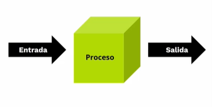
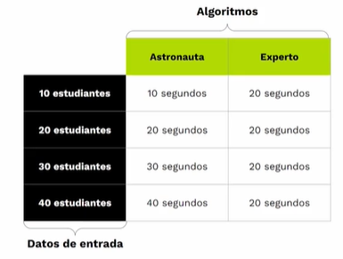
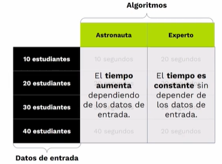
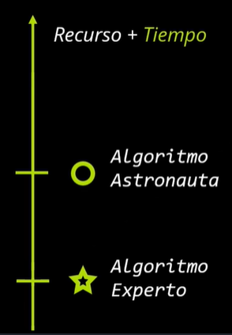
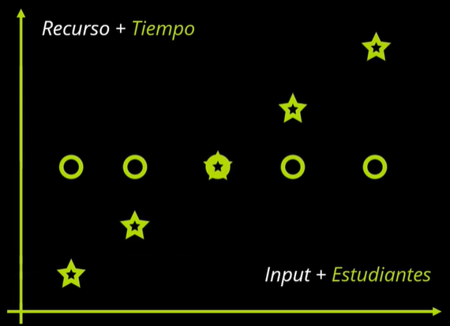

**ÍNDICE**

- [Complejidad Algorítmica](#complejidad-algorítmica)
  - [¿Qué es un algorítmo?](#qué-es-un-algorítmo)
  - [¿Cómo elegir un buen algorítmo?](#cómo-elegir-un-buen-algorítmo)
  - [Introducción a la complejidad algorítmica](#introducción-a-la-complejidad-algorítmica)
  - [Complejidad temporal](#complejidad-temporal)
    - [Práctica](#práctica)

# Complejidad Algorítmica

## ¿Qué es un algorítmo?

Es una solución a un problema. Solución en código a un problema
Es una secuencia de instrucciones que nos permite solucionar un problema



> Tenemos una lista desordenada como entrada, hace un proceo de ordenamiento y tenemos en la salida la lista ordenada

## ¿Cómo elegir un buen algorítmo?

Debemos tener en cuenta el tiempo y el espacio que lleva al ejecutarse

- ¿Cuánto tiempo se demora en ejecutarse?
- ¿Cuánto espacio en memoria usa el algoritmo?

Se puede optar por uno o por otro. Un ejemplo es facebook lite y facebook normal. Lite sacrifica el tiempo pero nos entrega optimización de espacio en disco al contrario de Fb normal.

> En javascript el mejor aspecto a tomar en cuenta es el tiempo ya que el espacio es tomado mucho más en cuenta con dispositivos embebidos (con chips)

- El tiempo es el factor más importante en Javascript y se lo mide en segundos, minutos, horas, etc...
- El espacio se mide en b, kB, mB, etc...

## Introducción a la complejidad algorítmica

La complejidad algorítmica estudia el consumo de recursos que un algorítmo ocupa

- Se basa en el crecimiento de los recursos, ya que es muy importante

## Complejidad temporal

No es importante el **cuánto demora un algorítmo en ejecutarse** sino, cómo aumenta gradualmente el tiempo de ejecución del algorítmo en relación a los datos de entrada.

En este **caso** medimos el tiempo de un algoritmo:




Vamos a analizar las tablas anteriores en un gráfico:




### Práctica

En javascript existe la interfaz `performance` que nos permite medir el tiempo de una línea de código a otra línea de código.

---

También existe `console.time()` pero no es tan **precisa** como `performance.now()`

> https://radiant-anchorage-11930.herokuapp.com/

- Performance.now()

```js
const contar = (n) => {
  for (let i = 0; i < n; i++) {
    console.log(i + 1);
  }
};

let initialTime = performance.now();
contar(5);
let finalTime = performance.now();

console.log(`Elapsed time: ${finalTime - initialTime} ms`);
```

- Console.time()

```js
const contar = (n) => {
  for (let i = 0; i < n; i++) {
    console.log(i + 1);
  }
};

console.time('duracion del algoritmo');
contar(5);
console.timeEnd('duracion del algoritmo');
```
