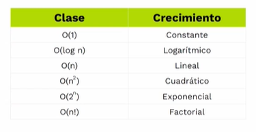
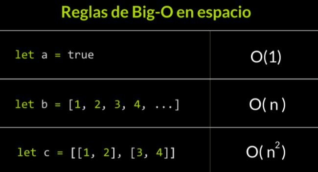
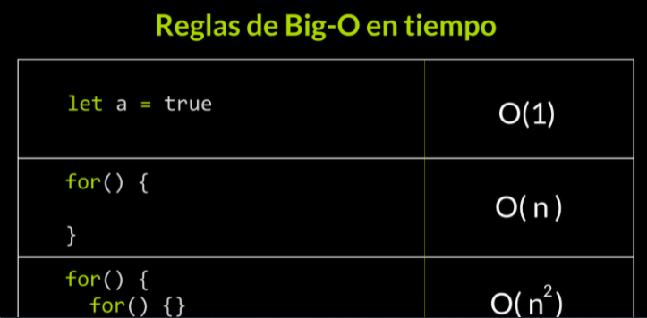
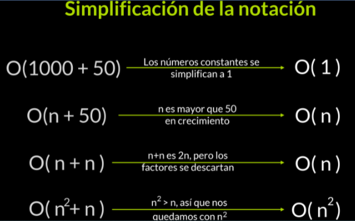

**ÍNDICE**

- [Complejidad Algorítmica](#complejidad-algorítmica)
  - [¿Qué es un algorítmo?](#qué-es-un-algorítmo)
  - [¿Cómo elegir un buen algorítmo?](#cómo-elegir-un-buen-algorítmo)
  - [Introducción a la complejidad algorítmica](#introducción-a-la-complejidad-algorítmica)
  - [Complejidad temporal](#complejidad-temporal)
    - [Práctica](#práctica)
  - [Complejidad Espacial](#complejidad-espacial)
    - [Espacio auxiliar](#espacio-auxiliar)
  - [Otras complejidades existentes](#otras-complejidades-existentes)
  - [Complejidad en el futuro](#complejidad-en-el-futuro)
- [Análisis Asintótico](#análisis-asintótico)
- [Notación Big-O](#notación-big-o)
  - [Clases de Big-O](#clases-de-big-o)
  - [Cálculo de la Notación Big-O](#cálculo-de-la-notación-big-o)
    - [Simplificar la notación](#simplificar-la-notación)
  - [Evaluación de la complejidad temporal con notación Big-O](#evaluación-de-la-complejidad-temporal-con-notación-big-o)
  - [Evaluación de la complejidad espacial con notación Big-O](#evaluación-de-la-complejidad-espacial-con-notación-big-o)
- [Recomendaciones para la evaluación de algoritmos](#recomendaciones-para-la-evaluación-de-algoritmos)
- [Retos de Análisis](#retos-de-análisis)

# Complejidad Algorítmica

## ¿Qué es un algorítmo?

Es una solución a un problema. Solución en código a un problema
Es una secuencia de instrucciones que nos permite solucionar un problema


> Tenemos una lista desordenada como entrada, hace un proceo de ordenamiento y tenemos en la salida la lista ordenada

## ¿Cómo elegir un buen algorítmo?

Debemos tener en cuenta el tiempo y el espacio que lleva al ejecutarse

- ¿Cuánto tiempo se demora en ejecutarse?
- ¿Cuánto espacio en memoria usa el algoritmo?

Se puede optar por uno o por otro. Un ejemplo es facebook lite y facebook normal. Lite sacrifica el tiempo pero nos entrega optimización de espacio en disco al contrario de Fb normal.

> En javascript el mejor aspecto a tomar en cuenta es el tiempo ya que el espacio es tomado mucho más en cuenta con dispositivos embebidos (con chips)

- El tiempo es el factor más importante en Javascript y se lo mide en segundos, minutos, horas, etc...
- El espacio se mide en b, kB, mB, etc...

## Introducción a la complejidad algorítmica

La complejidad algorítmica estudia el consumo de recursos que un algorítmo ocupa

- Se basa en el crecimiento de los recursos, ya que es muy importante

## Complejidad temporal

No es importante el **cuánto demora un algorítmo en ejecutarse** sino, cómo aumenta gradualmente el tiempo de ejecución del algorítmo en relación a los datos de entrada.

En este **caso** medimos el tiempo de un algoritmo:


Vamos a analizar las tablas anteriores en un gráfico:


### Práctica

En javascript existe la interfaz `performance` que nos permite medir el tiempo de una línea de código a otra línea de código.

---

También existe `console.time()` pero no es tan **precisa** como `performance.now()`

> https://radiant-anchorage-11930.herokuapp.com/

- Performance.now()

```js
const contar = (n) => {
  for (let i = 0; i < n; i++) {
    console.log(i + 1);
  }
};

let initialTime = performance.now();
contar(5);
let finalTime = performance.now();

console.log(`Elapsed time: ${finalTime - initialTime} ms`);
```

- Console.time()

```js
const contar = (n) => {
  for (let i = 0; i < n; i++) {
    console.log(i + 1);
  }
};

console.time('duracion del algoritmo');
contar(5);
console.timeEnd('duracion del algoritmo');
```

## Complejidad Espacial

En este caso analizamos el espacio que ocupa un algorítmo para resolver un problema. Puede ser medido en kB. mB, gB, etc...

- Se tiene en cuenta también el espacio auxiliar

### Espacio auxiliar

La complejidad espacial incluye el espacio auxiliar y el espacio ocupado por los datos de entrada.

El espacio auxiliar es el espacio ocupado por el cuerpo del algoritmo, pero no por los datos de entrada

`espacio total - espacio datos de entrada`

Los pasos realizados dentro del algoritmo, pueden ser operaciones que creen más espacio (como crear una lista donde ir dejando los resultados de un algoritmo de ordenamiento).

El espacio auxiliar es más importante que los datos de entrada.

## Otras complejidades existentes

- Accesos a memoria.
- Procesos paralelos.
- Comparaciones.

## Complejidad en el futuro

si decubrimos interesante optimizar el uso de un recurso en computación, allí tendremos un nuevo campo de estudio de complejidad.

# Análisis Asintótico

Es un método para descubrir el comportamiento limitante de una función.

1. Se analiza el comportamiento del algorítmo en una gráfica: https://radiant-anchorage-11930.herokuapp.com/
2. Se busca una función matemática similar para poder gráficar el comportamiento del algorítmo.

# Notación Big-O

Con esta notación, buscamos una manera de escribir la eficiencia de un logarítmo de una manera sencilla

Buscamos descubrir una función (constante, lineal, polinomial, logarítmica y exponencial) que sea **mayor o igual** a la complejidad del algoritmo

## Clases de Big-O

<center></center>

> https://www.geogebra.org/calculator/wc7dgmbt

O(1) = O(🤗)
O(log n) = O(🙂)
O(n) = O(😶)
O(n^2) = O(😪)
O(2^n) = O(😩)
O(n!) = O(😭)

## Cálculo de la Notación Big-O

Para medir el tiempo se debe tener en cuenta el tiempo de ejecución de cada línea de código, así:

```js
let bar = 'test'	// O(1)
if() {}		// O(1)
for() {}		// O(n)
while() {}	// O(n)
for() { for() {} }// O(n^2)
```

Para medir el espacio se debe tener en cuenta el espacio de cada línea de código, así:

```js
let bar = 'test'  // 0(1)
if () {}               // 0(1)
for () {}             // 0(1)
let resultado = [1,2,...,n]  // 0(n)
let dimensional = [[2,4],[6,8],[10,12]] //0(n^2)
```

### Simplificar la notación

Se debe simplificar lo más que se pueda, así:

- O(3 x n) = O(n)
- O(50) = O(1)
- O(n^2 + 50) = O(n^2)

> El crecimiento siempre importa

- La complejidad algorítmica nace para averiguar la cantidad de recursos que utiliza el algoritmo al ejecutarse
- La notación Big-O se enfoca en analizar el crecimiento

## Evaluación de la complejidad temporal con notación Big-O

Para hacer una medición del tiempo con notación Big-O, vamos a tener una operación sencilla entre el tiempo de cada instrucción de código, así:

- Cuando tenemos bucles anidados, entonces vamos a ver que tenemos un O(n^2)

```js
/**
 * Este algoritmo hace un ordenamiento burbuja para encontrar un elemento en un arreglo.
 * Complejidad temporal = O(n^2 + 9) = O(n^2)
 */

function bubbleSort(array) {
  let swapped = true; // O (1)
  let j = 0; // O (1)

  while (swapped) {
    // O (n)
    swapped = false; // O (1)
    j++; // O (1)

    for (let i = 0; i < array.length - j; i++) {
      // O (n)
      if (array[i] > array[i + 1]) {
        // O (1)
        let tmp = array[i]; // O (1)
        array[i] = array[i + 1]; // O (1)
        array[i + 1] = tmp; // O (1)
        swapped = true; // O (1)
      }
    }
  }

  return array; // O (1)
}
```

## Evaluación de la complejidad espacial con notación Big-O

- Siempre se debe tomar el valor más grande en la notación Big-O

Se debe tener en cuenta el espacio que es usado por el algorítmo:

```js
/**
 * Este algoritmo hace un ordenamiento por selección para encontrar un elemento en un arreglo.
 * Complejidad temporal = O(n^2 + 8) = O(n^2)
 * Complexidad espacial = O(n)
 * Espacio auxiliar = Complexidad espacial - espacio temporal = O(1)
 */

function selectionSort(array) {
  // O(n)
  for (let i = 0; i < array.length; i++) {
    // O(1)
    let min = i; // O(1)

    for (let j = i + 1; j < array.length; j++) {
      // O(1)
      if (array[j] < array[min]) {
        min = j;
      }
    }

    if (min !== i) {
      let tmp = array[i]; // O(1)
      array[i] = array[min];
      array[min] = tmp;
    }
  }

  return array;
}
```

# Recomendaciones para la evaluación de algoritmos

El crecimiento no siempre importa, hay otras variables que entran en juego para determinar si un algoritmo es bueno o no.

Tengamos en cuenta algo: Un algoritmo no se va a ejecutar de la misma manera en una computadora de los años 2000 a comparación de una computadora de los años actuales

# Retos de Análisis

> Esta es mi solución, sin embargo pues cambiar

- Complejidad temporal: O(n^2)
- Complejidad espacial: O(n)
- Espacio auxiliar: O(1)

```js
async function algoritmoAlfa(payloadId, payloadAPI) {
  let respuesta = await fetch(payloadAPI);
  let data = await respuesta.json();

  for (let i = 0; i < data.length; i++) {
    let payloads = data[i].rocket.second_stage['payloads'];
    for (let j = 0; j < payloads.length; j++) {
      if (payloadId == payloads[j].payload_id) {
        return true;
      }
    }
  }

  return false;
}
```

- Complejidad temporal: O(n^2)
- Complejidad espacial: O(n)
- Espacio auxiliar: O(1)

```js
async function algoritmoBeta(payloadId, payloadAPI) {
  let arreglosCoinciden = (arreglo1, arreglo2) => {
    if (arreglo1.length != arreglo2.length) {
      return false;
    }

    for (let i = 0; i < arreglo1.length; i++) {
      if (arreglo1[i] != arreglo2[i]) {
        return false;
      }
    }

    return true;
  };

  let respuesta = await fetch(payloadAPI);
  let data = await respuesta.json();
  let payloadIdArray = payloadId.split('');

  for (let i = 0; i < data.length; i++) {
    let payloads = data[i].rocket.second_stage.payloads;
    for (let j = 0; j < payloads.length; j++) {
      if (arreglosCoinciden(payloadIdArray, payloads[j].payload_id.split(''))) {
        return true;
      }
    }
  }

  return false;
}
```

- Complejidad temporal: O(n)
- Complejidad espacial: O(n)
- Espacio auxiliar: O(1)

```js
async function algoritmoDelta(payloadId, payloadAPI) {
  let respuesta = await fetch(payloadAPI);
  let data = await respuesta.json();
  let listaDePayloads = [];
  let longitudData = data.length;

  for (let i = 0; i < longitudData; i++) {
    let payloads = data[i].rocket;
    listaDePayloads.push(...payloads.second_stage['payloads']);
  }

  for (let i = 0; i < listaDePayloads.length; i++) {
    let localPayloadId = listaDePayloads[i].payload_id;

    if (localPayloadId == payloadId) {
      return true;
    } else {
      return false;
    }
  }
}
```




