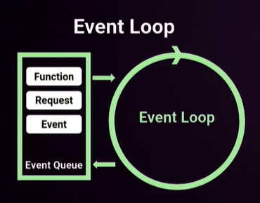
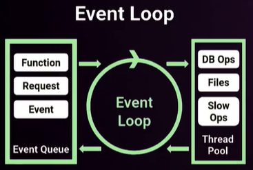
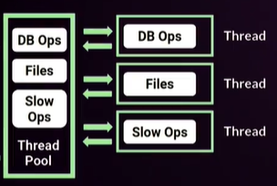
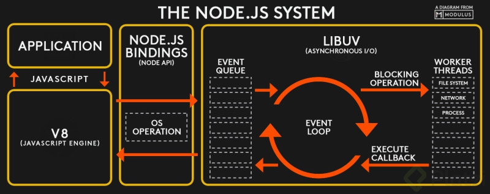

**ÍNDICE**

# ¿Qué es NODE JS?

Es un entorno de ejecución de JavaScript fuera del navegador. Fue creado en 2009 y está orientado a los servidores

**Datos de NODE JS**

1. Concurrencia

   - Monohilo, con entradas y salidas asíncronas
   - Un proceso por cada núcleo del procesador

2. Motor V8

   - Corre sobre el motor V8 de Google
   - El moto V8 está escrito en C++
   - Convierte JS en código máquina en lugar de interpretarlo en tiempo real. Esto nos brinda muchísimo más velocidad

3. Funciona en base a módulos

   - Todo lo que no sea sintaxis de programación, es un módulo
   - Node JS trae sus propios módulos, los cuáles son piezas de código muy pequeñas.
   - Podemos crear nuestros propios módulos

4. Orientado a Eventos

   - Hay un bucle de eventos que se ejecuta constantemente
   - Podemos orientar el código de forma reactiva

# Event Loop: Asíncrona por Diseño

Se encarga de resolver los eventos ultra rápidos que llegan desde el `Event Queue`.
En caso de no poder resolverse rápido, enviá el evento al `Thread Pool`.

> Asíncrono => Que todos los eventos están ejecutándose aparte y el EventLoop puede estar recibiendo más eventos


## Event Queue

Contiene todos los eventos que se generan por nuestro código `Funciones, peticiones`, estos eventos quedan en una cola que van pasando uno a uno al Event Loop.



## Thread Pool

Se encarga de gestionar los eventos como `llamados a APIs, promesas, etc` de forma asíncrona. Una vez terminado lo devuelve al Event Loop.

El Event Loop vera si lo pasa a Event Queue o no.



Para cada evento que tiene que ejecutar Thread Pools, se crea un nuevo hilo en nuestro procesador y nosotros podemos seguir ejecutando nuestro código de forma síncrona



## Imagen Resumida



# Monohilo: implicaciones en diseño y seguridad

Todo lo que puede fallar va a fallar. Ley de Murphy.

Hay que tener cuidado con el dieño de nuestro código, ya que si falla algo, todo el proceso que estamos ejecutando también va a fallar

En el siguiente código:

```js
console.log('Hola mundito');

setInterval(() => {
  console.log('Holiii');
}, 1000);

console.log('Segundo mensaje');
```

El output sería así:

```zsh
Hola mundito
Segundo mensaje
Holiii
Holiii
Holiii
.
.
.
.
```

# Configurar las variables de entorno en Node.js
