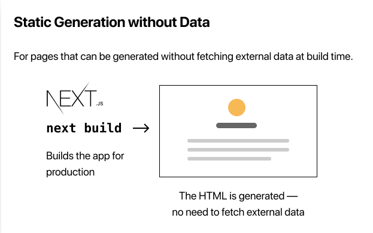

<h1>Next Js, el framework de React</h1>

**Índice**

- [¿Qué es Next Js?](#qué-es-next-js)
- [Algunas características importantes de Next Js](#algunas-características-importantes-de-next-js)
- [Setup de una aplicación de Next Js](#setup-de-una-aplicación-de-next-js)
- [Navegando entre páginas](#navegando-entre-páginas)
- [Code spliting y prefetching](#code-spliting-y-prefetching)
- [Assets, Metadata y CSS](#assets-metadata-y-css)
  - [**Assets**](#assets)
  - [**Metadata**](#metadata)
  - [**JavaScript de terceros**](#javascript-de-terceros)
  - [**CSS Styling**](#css-styling)
  - [**Global Styles**](#global-styles)
- [Pre Renderizaje y Fetching de Datos](#pre-renderizaje-y-fetching-de-datos)
  - [Formas de hacer Pre-renderizado](#formas-de-hacer-pre-renderizado)
  - [Cuánto usar `Static Generation` y cuándo usar `Server Side Rendering`](#cuánto-usar-static-generation-y-cuándo-usar-server-side-rendering)
  - [Static Generation with and without Data](#static-generation-with-and-without-data)
    - [Static Generation with Data using `getStaticProps`](#static-generation-with-data-using-getstaticprops)
  - [Implementando `getStaticProps`](#implementando-getstaticprops)

## ¿Qué es Next Js?

Es un framework de React que permite crear páginas web dinámicasm rápidamente.

Provee una capa de configuración necesaria para React, además de estructura adicional, características y optimizaciones para la aplicación.


<h3><strong>
Algunas consideraciones que hay que tener en cuenta cuando desarrollamos con React JS y que Next JS puede ayudar a resolver:
</strong>
</h3>

- El **código debe empaquetarse** con un paquete como webpack y transformarse con un compilador como Babel.
- Debe realizar **optimizaciones de producción**, como la división de código.
- Es posible que desee renderizar previamente estáticamente algunas páginas para mejorar el rendimiento y el SEO. También es posible que desee utilizar la **representación del lado del servidor** o la **representación del lado del cliente**.
- Es posible que deba escribir algún código del lado del servidor para conectar su aplicación React a su database.

## Algunas características importantes de Next Js

Next JS provee:

- Un **sistema de enrutamiento intuitivo** basado en páginas (con soporte para rutas dinámicas)
- La representación previa, tanto la **generación estática (SSG)** como la **representación del lado del servidor (SSR)** son compatibles por página
- **División automática de código** para cargas de página más rápidas
- **Enrutamiento del lado del cliente** con captación previa optimizada
- Soporte integrado de **CSS y Sass**, y soporte para cualquier biblioteca **CSS-in-JS**
- Entorno de desarrollo con **soporte Fast Refresh**
- **Rutas de API** para crear puntos finales de API con funciones sin servidor
  -Totalmente extensible

## Setup de una aplicación de Next Js

Necesitas tener instalado Node.js, se necesita la versión 10.16.3 o superior. Visita la [documentación de Node.js](https://nodejs.org/en/download/) para más información.

Para crear un proyecto, ejecutamos el siguiente script en la terminal:

```bash
npx create-next-app nextjs-blog --use-npm --example "https://github.com/vercel/next-learn/tree/master/basics/learn-starter"
```

El anterior script sirve para crear un proyecto de Next Js con una plantilla de Next Js de ejemplo.

## Navegando entre páginas

> Documentación de rutas: https://nextjs.org/docs/routing/introduction

En Next Js, `una página` es un componente de React que se exporta desde un archivo en el directorio `pages`.

Las páginas están asociadas con un enrutado basado en el nombre del archivo:

- `pages/index.js` => `/`
- `pages/about.js` => `/about`
- `pages/posts/first-post.js` => `/posts/first-post`

Para navegar entre páginas en **Next Js** usamos el componente `Link` de `next/link` que nos va a permitir hacer una navegación en el cliente a una página en la aplicación.

- Usando `Link` para navegar entre páginas:

```jsx
// Importamos el componente Link de Next Js
import Link from 'next/link';

<h1 className='title'>
  Read
  <Link href='/posts/first-post'>this page!</Link>
</h1>;
```

El componente **Link** necesita de una propiedad `href` que es el enlace a la página que queremos navegar. Este componente no acepta la palabra **className**, sino que si queremos darle un estilo, debemos usar una etiqueta **a** y pasarle la propiedad \*_className_:

```jsx
<h1 className='title'>
  Read
  <Link href='/posts/first-post'>
    <a className='link'>this page!</a>
  </Link>
</h1>
```

## Code spliting y prefetching

Next Js hace que solamente se cargue contenido en demanda de nuestra aplicación, teniendo así una mejor experiencia de usuario y velocidad de carga.

## Assets, Metadata y CSS

<!-- https://nextjs.org/learn/basics/assets-metadata-css -->

### **Assets**

Para añadir imágenes a la aplicación, podemos hacer uso del componente `Image` de `next/image`, el cuál va a ayudarnos a redimensionar y optimizar la imagen por defecto. Las imágenes en Next Js se cargan bajo demanda, es decir, tienen lazy load por defecto.

```jsx
import Image from 'next/image';

<Image src='/static/images/image.jpg' height='200px' width='200px' alt='My image' />;
```

### **Metadata**

Para añadir metadatos a las páginas de Next Js, podemos hacer uso del componente `Head` de `next/head`. Nos va a permitir

```jsx
import Head from 'next/head';

<Head>
  <title>My page title</title>
  <meta name='description' content='My page description' />
</Head>;
```

### **JavaScript de terceros**

Este código se refiere a todo script que se carga desde un recurso de terceros, como por ejemplo, analytics, ads, etc...

Primera forma de añadir JavaScript de terceros a nuestra aplicación:

```jsx
import Head from 'next/head';

<Head>
  <title>First Post</title>
  <script src='https://connect.facebook.net/en_US/sdk.js' />
</Head>;
```

Segunda forma, usando el componente `Script` de `next/script`:

```jsx
import Head from 'next/head';
import Script from 'next/script';

<Head>
  <title>First Post</title>
</Head>

<Script
  src="https://connect.facebook.net/en_US/sdk.js"
  strategy="lazyOnload"
  onLoad={() =>
    console.log(`script loaded correctly, window.FB has been populated`)
  }
/>
```

### **CSS Styling**

Next Js tiene soporte para Css y Sass, y soporta tanto CSS-in-JS como CSS-in-JS-in-JS.

Para añadir estilos con `Css Modules` vamos a crear un archivo css con el nombre `descriptiveName.module.css` y luego añadir una importación de este módulo en el archivo en donde queramos aplicar el estilo. Trabaja en el scope de componentes, y no en el scope global.

```jsx
import Link from 'next/link';
import styled from 'path-to-styles';

<h1 className={styles.title}>Leninner</h1>;
```

También puedes usar Scss para añadir módulos de estilos. Solo asegúrate de instalar scss

```bash
npm install -D sass
```

### **Global Styles**

**Css Modules** trabaja muy bien con componentes, pero para añadir estilos globales, debemos crear una página en el directorio **`pages/_app.js`** con el siguiente contenido:

```jsx
export default function App({ Component, pageProps }) {
  return <Component {...pageProps} />;
}
```

En el directorio raiz vamos a crear un directorio `styles` y dentro de este vamos a crear un archivo `global.css` con el siguiente deseado y luego vamos a importar ese archivo en el archivo `_app.js`:

```jsx
import '../styles/global.css';

export default function App({ Component, pageProps }) {
  return <Component {...pageProps} />;
}
```

## Pre Renderizaje y Fetching de Datos

Por defecto, **Next Js pre-renderiza cada página de nuestro sitio web**. Esto significa que Next.js **genera HTML para cada** página por adelantado.

En lugar de tenerlo todo hecho por JavaScript del lado del cliente. **La renderización previa puede resultar en un mejor rendimiento y SEO.**

> Cada HTML generado está asociado con el código **JavaScript mínimo necesario** para esa página. Cuando el navegador carga una página, su código JavaScript se ejecuta y hace que la página sea completamente interactiva. (Este proceso se llama `**hidratación**`.)


### Formas de hacer Pre-renderizado

Next Js tiene dos formas de hacer pre-renderizado, la diferencia está en `cuando` se genera el HTML.

- `Static Generation`: Se genera el HTML en **build time**. El HTML renderizado previamente se reutiliza en cada solicitud.


- `Server Side Rendering`: Se genera el HTML en **cada request**. El HTML renderizado previamente se reutiliza en cada solicitud.


> En el modo de desarrollo (cuando ejecuta `npm run dev` o `yarn dev`), cada página se renderiza previamente en cada solicitud, incluso para páginas que usan static generation.

> Next Js nos permite elegir el modo de pre-renderizado que queramos, ya sea, `Static Generation` o `Server Side Rendering`. **También se puede hacer una app de Next Js híbrida**


### Cuánto usar `Static Generation` y cuándo usar `Server Side Rendering`

> Es muy recomendable usar `Static Generation` (con y sin datos) siempre que sea posible, porque su página puede construirse una vez y servirse mediante CDN, lo que lo hace mucho más rápido que tener un servidor que renderice la página en cada solicitud.

Puede usar la generación estática para muchos tipos de páginas, que incluyen:

- Páginas de marketing
- Publicaciones de blog
- Listados de productos de comercio electrónico
- Ayuda y documentación

> Preguntarse: "¿Puedo renderizar previamente esta página antes de la solicitud de un usuario?" Si la respuesta es afirmativa, entonces debe elegir Generación estática.

No deberíamos usar `Static Generation` cuando tengamos datos que se estén actualizando en tiempo real y el HTML cambie en cada solicitud. En ese caso, debemos usar `Server Side Rendering`, que será más lento, pero mostrará el HTML actualizado, o se puede saltar el paso de renderizado previo y usar el `client-side-rendering` para renderizar la página.

### Static Generation with and without Data

Las páginas se pueden renderizar sin hacer fetching de datos. Esas páginas serán estáticamente generada en el momento del **build para producción**



También se puede trabajar con datos:


#### Static Generation with Data using `getStaticProps`

Cuando exportar una página en Next Js, podemos exportar una función asíncrona que corre en **build time en producción** y dentro de la función puedes hacer fetch de datos externos y enviarlos como props a la página, así:

```jsx
export default function Home(props) { ... }

export async function getStaticProps() {
  // Get external data from the file system, API, DB, etc.
  const data = ...

  // The value of the `props` key will be
  //  passed to the `Home` component
  return {
    props: ...
  }
}
```

- **getStaticProps()** le dice a Next Js: `“Hey, this page has some data dependencies — so when you pre-render this page at build time, make sure to resolve them first!”`

### Implementando `getStaticProps`

Para parsear datos en Markdown, debemos instalar el paquete `gray-matter`, con:

```bash
npm install gray-matter
```

Un ejemplo de como usar `getStaticProps`:

```jsx
export async function getStaticProps() {
  const allPostsData = getSortedPostsData();

  return {
    props: {
      allPostsData,
    },
  };
}
```

- En **desarrollo** (npm run dev o yarn dev), `**getStaticProps**` se ejecuta en **cada solicitud.**
- En **producción**, getStaticProps **se ejecuta en el momento de la compilación**. Sin embargo, este comportamiento se puede mejorar utilizando la clave alternativa devuelta por getStaticPaths

> Esta función solo puede ser exportada en una página de Next Js, no de un no-page de Next Js.
