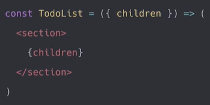
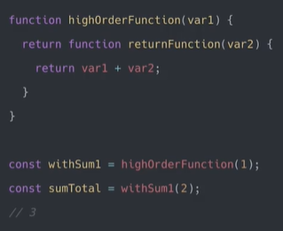

**ÍNDICE**

- [Patrones de Render y Composición](#patrones-de-render-y-composición)
  - [Composición de Componentes](#composición-de-componentes)
  - [Render Props y Render Functions](#render-props-y-render-functions)
  - [React.Children y React.cloneElement](#reactchildren-y-reactcloneelement)
  - [High Order Components](#high-order-components)

# Patrones de Render y Composición

Escribir código limpio y fácil de mantener es muy importante, pero es difícil llegar a hacerlo. Sin embargo, existen patrones creados por el equipo de Facebook para poder hacer este trabajo más fácil

> React prefiere el código aburrido en lugar del código elegante

- Links de interés:
  - https://es.reactjs.org/docs/design-principles.html
  - https://reactjs.org/docs/composition-vs-inheritance.html
  - https://kentcdodds.com/blog/colocation
  - https://platzi.com/blog/paradigmas-programacion/

## Composición de Componentes

Piensa en esto: El elemento padre va a estar controlando que va a ir dentro el componente hijo, en lugar de que lo haga el componente hijo, así, podemos evitar un hell de props:


<hr/>

```js
import { TodoCounter } from 'path/to/TodoCounter';
import { TodoSearch } from 'path/to/TodoSearch';
import { TodoList } from 'path/to/TodoList';

const TodoApp = () => {
  <TodoList>
    <TodoCounter />
    <TodoSearch />
  </TodoList>;
};
```

## Render Props y Render Functions

1. Render Props

   - Son funciones que se le envian a un componente a través de propiedades y dependiendo de lógica que nosotros hagamos, podemos renderizar algo.
   - Las render props nos permiten ser más específicos sobre que vamos a renderizar, cuando y donde vamos a renderizar cada parte del contenido de nuestros componentes.

2. Render Functions
   - Son funciones que se crean en la propiedad children de un componente y son similares a las funciones de las **render props**.

- Ejemplo con Render Props

```js
<TodoList
  onError={(error) => <TodoError error={error} />}
  onLoading={() => <TodoLoading />}
  onEmptyTodos={() => <EmptyTodos />}
  render={(todo) => <RenderTodos {...todo} />}
/>
```

- Ejemplo con Render Functions

```js
<TodoList>
  {(todos) => {
    <RenderTodos {...todos} />;
  }}
</TodoList>
```

- Ejemplo de Mezclar Render Props y Render Functions

  - Punto de entrada

```js
<TodoList
  error={error}
  loading={loading}
  searchedTodos={searchedTodos}
  onError={() => <TodoError />}
  onLoading={() => <TodoLoading />}
  onEmptyTodos={() => <TodoEmpty />}>
  {(todo) => (
    <TodoItem
      key={todo.text}
      text={todo.text}
      completed={todo.completed}
      onComplete={() => {
        completeTodos(todo.text);
      }}
      onDelete={() => {
        deleteTodos(todo.text);
      }}
    />
  )}
</TodoList>
```

- Todo List

```js
export const TodoList = (props) => {
  const { error, loading, searchedTodos, onError, onLoading, onEmptyTodos, children, render } = props;

  const renderFunction = children || render;

  return (
    <section>
      {error && onError()}
      {loading && onLoading()}
      {!loading && !searchedTodos.length && onEmptyTodos()}
      {searchedTodos.map(renderFunction)}
    </section>
  );
};
```

## React.Children y React.cloneElement

> https://es.reactjs.org/docs/react-api.html

- **React.Children**:

```js
React.Children.map(children, function[(thisArg)])
```

React.Children proporciona utilidades para lidiar con la estructura de datos opaca de this.props.children.

- **React.cloneElement**:

```js
React.cloneElement(element, [config], [...children]);
```

Clona y retorna un elemento React usando **element** como punto de partida. **config** debe contener todas las nuevas props, key, o ref.
El elemento resultante tendrá las props del elemento original con las nuevas props **combinadas superficialmente**.
Los nuevos hijos reemplazarán los hijos existentes.

> key y ref del elemento original serán preservadas si key y ref no están presentes en la configuración.

## High Order Components

> High Order Funcion => Son funciones que retornan otras funciones



Los HOC son componentes que retornan otros componentes, así:

```js
function withApi(WrapperComponent) {
  const apiData = fetchApi('url');

  return function WrapperComponentWithApi(props) {
    return <WrapperComponent data={apiData.json} />;
  };
}
```
