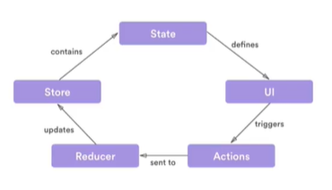

# ¿Qué es Redux?

> Documentación: https://redux.js.org/

Es una sistema que nos ayuda a mantener, compartir y actualizar datos en tiempo real. Es una libreria agnóstica de dónde se la utilice.

Tres principios de Redux:

    1. Única fuente de la verdad (store)
    2. El estado es de solo lectura (actions), es decir, que no vamos a poder cambiar el estado **arbitrariamente**. Debemos cambiar el estado de la aplicación a través de **actions** que van a describir qué va a pasar.
    3. Los cambios deben realizarse a través de **funciones puras** (reducers).

> El estado o state es un objeto que tiene varias capaz de profundidad y es común tener un key/value pair.
> El store engloba al estado, selectores, dispatcher, suscribers, etc.

# Ciclo de vida de Redux

- El estado = Es un objeto que contiene los datos con los que onteractua actualmente la vista.

- La vista = La vista consume los datos del estado para mostrarlos al usuario.

- Cuando el usuario interactia con la vista dispara una accion.

- Si definimos middlewares, la accion llega alli y luego es enviada hacia el reducer, este se sirve del estado, decide si ejecutar otra accion o no y define que accion se ejecutara en el estado, modificando y actualizando los datos involucrados.

# Diferencias entre Redux y Context API

Depuración:

- Redux tiene un depurador que nos permite viajar en el tiempo y ver el estado de la aplicación.
- Context API al no tener acciones claras, es un poco difícil entender que es lo que está pasando.

Bundle Size:

- Context API al estar integrado con React, no va a agrandar nuestro Bundle Size al contrario de Redux, ya que es un librería aparte.

Middlewares:

- Redux nos provee mucha facilidad para crear custom middlewares

Curva de Aprendizaje:

- Context API es más amigable cuando la estamos aprendiendo al contrario de Redux

Rendering:

- Redux permite prevenir rendering inapropiado, es decir, que no se renderice la vista si no hay cambios en el estado de la aplicación al contrario de Context API.
