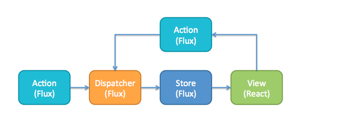
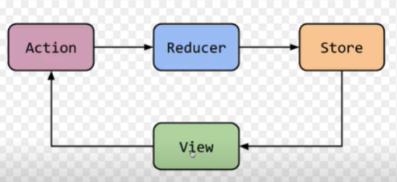
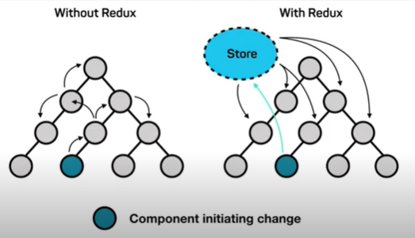
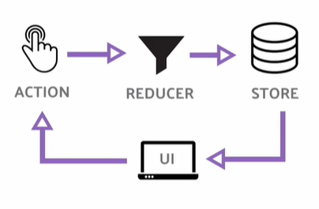

# Redux

Flux: https://carlosazaustre.es/como-funciona-flux

> **Arquitectura Flux**: Es aquella que soluciona los problemas del patrón MVC que tenía flujo de datos bidireccional y lo reemplaza por una arquitectura unidereccional donde la vista genera una acción y esta acción a su vez provoca un reducer que a su vez actualiza el estado general y finalmente se actualiza la vista. Todo es un paso unidireccional de datos



Redux es una librería escrita en JavaScript, basada en la **arquitectura Flux**, creada con Facebook y creada por Dan Abramov, se basa en 3 principios fundamentales:

1. **Única fuente de la verdad:**
   Nuestra aplicación solo debe de tener un único Store y es la única fuente de información.

2. **El estado es de solo lectura**
   La única forma de modificar el estado es emitiendo un acción, este objeto describe lo que va a ocurrir.

3. **Los cambios se realizan con funciones puras**
   Para realizar cambios al estado es necesario utilizar Reducers los cuales son funciones puras que toman el estado anterior, una acción y devuelve un nuevo estado con las modificaciones necesarias.

Nuestra UI va a activar una action, esta action va a ejecutar un reducer para modificar la información del store, y al actualizarse el store la UI se va a modificar.

Redux propone una forma de manejar el estado donde podamos controlar cómo vamos a interactuar con otros elementos (llamadas a un API) o interacciones dentro de nuestra aplicación, Redux hace intento de predecir las mutaciones que pueda sufrir el estado, creando restricciones de `cuando y como` pueden ser ejecutadas las actualizaciones en nuestras aplicaciones.





## Responsabilidades del Store

- Contiene el estado de la aplicación
- Permite el acceso al estado vía getState()
- Permite que el estado sea actualizado vía dispatch(action)
- Registra los listeners vía subscribe(listener)
- Maneja la anuliación del registro de los listeners via el retorno de la función de subscribe(listener)

## Instalación de Redux

Para instalar en nuestro proyecto:

```bash
npm install redux react-redux --save
```

- **redux** => Trae todos los elementos necesarios de la librería de `Redux`
- **react-redux** => Nos permité implementar `redux` de una manera más fácil en react.

## Implementación de Redux en React

1. En la carpeta `src` del proyecto debemos crear dos carpetas:

   1. `actions`
   2. `reducers`

Dentro de cada una, debemos crear un archivo `index.js`

2. En el archivo `index.js` de la raíz de la carpeta `src` vamos a hacer 2 importes:

```js
import { Provider } from 'react-redux';
```

- Nos da un provider que nos va a permitir `encapsular` nuestros componentes a través de un `conect` que va a tener toda la información del `store ` transmitida a estos componentes. De esta forma vamos a poder extraer el estado que tengamos en toda la App, y así tener en cada componente la info que necesita

```js
import { createStore } from 'redux';
```

- Nos va a ayudar a crear el `store` y compartir a toda la App

3. Inicializamos la aplicación con el `Provider` que importamos anteriormente:

```js
// /src/index.jsx
import React from 'react';
import ReactDOM from 'react-dom';
import App from './routes/App';
import { Provider } from 'react-redux';
import { createStore } from 'redux';

ReactDOM.render(
  <Provider>
    <App />
  </Provider>,
  document.getElementById('app')
);
```

## Creación de la Store para manejar el estado

En el archivo de la ruta `/src/index.jsx` vamos a crear el estado fuera el método para renderizar la App:

- Con un ejemplo quedaría así:

```js
import React from 'react';
import ReactDOM from 'react-dom';
import App from './routes/App';
import { Provider } from 'react-redux';
import { createStore } from 'redux';

const initialState = {
  user: {},
  playing: {},
  mylist: [],
  trends: [
    {
      id: 2,
      slug: 'tvshow-2',
      title: 'In the Dark',
      type: 'Scripted',
      language: 'English',
      year: 2009,
      contentRating: '16+',
      duration: 164,
      cover: 'http://dummyimage.com/800x600.png/99118E/ffffff',
      description: 'Vestibulum ac est lacinia nisi venenatis tristique',
      source: 'https://mdstrm.com/video/58333e214ad055d208427db5.mp4',
    },
  ],
  originals: [
    {
      id: 8,
      slug: 'tvshow-8',
      title: 'Stargate Atlantis',
      type: 'Action',
      language: 'English',
      year: 2012,
      contentRating: '16+',
      duration: 148,
      cover: 'http://dummyimage.com/800x600.png/306880/ffffff',
      description: 'Vestibulum ac est lacinia nisi venenatis tristique',
      source: 'https://mdstrm.com/video/58333e214ad055d208427db5.mp4',
    },
  ],
};

ReactDOM.render(
  <Provider>
    <App />
  </Provider>,
  document.getElementById('app')
);
```

Luego de haber hecho esto, creamos otra constante en donde vamos a crear la `referencia a la store`, esto lo lgoramos con `createStore` que importamos anteriormente de Redux la cuál recibe 2 parámetros:

1. Recibe todos los reducers de la Aplicación
2. Estado Inicial

```js
const store = createStore(reducer, initialState);
```

o

```js
const store = createStore(
  {}, // todos los reducers
  {} // estado inicial);
```

Luego vamos a pasarle un parámetro `store` con la variable que creamos anteriormente al Provider de `/src/index.jsx`:

- Este store va a estar disponible para el componente general `App`

```js
const store = createStore(reducer, initialState);

ReactDOM.render(
  <Provider store={store}>
    <App />
  </Provider>,
  document.getElementById('app')
);
```

## Conectar componentes con Redux

Para conectar un componente a Redux vamos a necesitar importar `connect` de react-redux en cada componente:

```js
import { connect } from 'react-redux';
```

Al momento de exportar debemos hacerlo con `connect` va a aceptar dos parámetros:

1. **mapStateToProps (props):** Es una función que le va a indicar al **provider** qué información necesitamos del store, es decir que el store nos va a pasar esa información por medio de los props del componente en el que lo indicó o que está suscrito o conectado a través de `connect`. Las props solo los pasamos una vez y vienen directamente del store `la única fuente de la verdad`.

   > Solicita información del estado

2. **mapDispatchToProps (actions):** es un objeto con las distintas funciones para ejecutar una action en Redux.

   > Envía información para el reducer que se encargará de actualizar el estado. Debemos importar al componente el action que nos va a ayudar a ejecutar el reducer y actualizar la vista. De esta manera se consigue la arquitectura flux.

- Así exportamos un elemento con `connect`:

```js
// export default connect(props, dispatcher)(componente)
export default connect(mapStateToProps, null)(Home); // componente conectado al provider para utilizar el estado
```

> Si no existe ningún elemento a pasar, se debe enviar un valor nulo

- En el ejemplo como SI añadimos una función `mapStateToProps`, la creamos para traer únicamente las props que necesitamos del estado general:

```js
const mapStateToProps = (state) => {
  return {
    myList: state.myList,
    trends: state.trends,
    originals: state.originals,
  };
};
```

Y luego podemos llamarlos en las props del componente:

```js
const Home = ({ myList, trends, originals }) => {
  //code
};
```

## Creación de Reducers y Actions

Primero que nada, vamos a identificar nuestros archivos de las carpetas `reducers` y `actions`.

### Actions

Vamos a crear nuestro primer action en `/src/actions/index.js`

- Vamos a crear el primero el cuál se encarga de describir la información que vamos a hacer y pasar un objeto que vamos a tener disponible **dentro del reducer**, el cuál después va a tomar la acción que vamos a estar ejecutando para evaluar como lo va a guardar dentro del estado.

```js
export const setFavorite = (payload) => {
  return {
    type: 'SET_FAVORITE',
    payload,
  };
};

export const deleteFavorite = (payload) => {
  return {
    type: 'DELETE_FAVORITE',
    payload,
  };
};
```

> Type => Es el encargado de describir el nombre de la acción que estamos haciendo. Utilizamos SNAKE_CASE para nombrar estos tipos

### Reducers

En el archivo de `/src/reducers/index.js` vamos a trabajar nuestros reducers:

- Vamos a crear dentro de nuestra función `reducer` un switch que nos va a ayudar a ejecutar código cuando el type de nuestra acción coincida con algo:

- Primero debemos crear el caso `default` que retorne el estado para que en el caso de que ninguna acción coincida en los criterios, se retorne por defecto el estado. Ya luego, puedo añadir cualquier otro tipo de lógica para actualizar el estado general.

```js
const reducer = (state, action) => {
  switch (action.type) {
    case 'SET_FAVORITE':
      return {
        ...state,
        myList: [...state.myList, action.payload],
      };
    case: "DELETE_FAVORITE":
      return {
        ...state, myList: state.myList.filter(item => item.id !== action.payload)
      }
    default:
      return state;
  }
};

export { reducer };
```

#### Otra manera para crear el archivo de reducers:

- Importar `combineReducers` que nos va a servir para combinar todos los reducers que tengamos y que se haga un solo reducer válido que pueda ser consumido por la función `createStore` en `src/index.jsx`

```js
import { combineReducers } from 'redux';

export default combineReducers({});

// Para importar en src/index.jsx

import reducers from './reducers';
```

Para utilizar estas funciones en nuestros objetos tenemos que conectarlos a través de `connect` y crear la función que va solicitar al Provider la info que necesitamos para poder ejecutarlas, también debemos importar esas funciones:

- Ejemplo de uso:

```js
import React from 'react';
import { connect } from 'react-redux';
import { setFavorite, deleteFavorite } from '../actions';

const CarouselItem = (props) => {
  const { id, cover, title, year, contentRating, duration } = props;

  const handleSetFavorite = () => {
    props.setFavorite({ id, cover, title, year, contentRating, duration });
  };

  const handleDeleteFavorite = (itemId) => {
    props.deleteFavorite(itemId);
  };

  return (
    <div className='carousel-item'>
      
      <div className='carousel-item__details'>
        <div>
          
          
           handleDeleteFavorite(id)}
          />
        </div>
        <p className='carousel-item__details--title'>{title}</p>
        <p className='carousel-item__details--subtitle'>{`${year} ${contentRating} ${duration}`}</p>
      </div>
    </div>
  );
};

const mapDispatchToProps = {
  setFavorite,
  deleteFavorite,
};

export default connect(null, mapDispatchToProps)(CarouselItem);
```

## Debug con Redux Devtools

Herramienta para conocer el flujo de información de nuestra aplicación. Para conectarlo con la extensión de Chrome debemos importar `compose` y crear un función de la siguiente manera:

- Esto se hace en `index.js` de la raíz de la carpeta `src`:

```js
import React from 'react';
import ReactDOM from 'react-dom';
import App from './routes/App';
import { Provider } from 'react-redux';
import { createStore, compose } from 'redux';
import { reducer } from './reducers';

const initialState = {
  user: {},
  playing: {},
};

const composeEnhancers = window.__REDUX_DEVTOOLS_EXTENSION_COMPOSE__ || compose;

const store = createStore(reducer, initialState, composeEnhancers());

ReactDOM.render(
  <Provider store={store}>
    <App />
  </Provider>,
  document.getElementById('app')
);
```

## Redux Thunk

Redux-thunk te permite escribir creadores de acciones que retornan una función en vez de un objeto de acción típico, sirve para hacer peticiones asíncronas. Para instalar en nuestro proyecto:

```js
npm install redux-thunk
```

- Para implementarlo en el proyecto:
  En el archivo index.jsx de la raíz de la carpeta src vamos a hacer un importe:

```js
import reduxThunk from 'redux-thunk';
```

Luego, desde redux vamos a importar `apllyMiddleware`:

```js
import { applyMiddleware } from 'redux';
```

Y para usarlo, lo debemos pasar a la función `createStore` como un parámetro:

```js
const AppStore = createStore(reducer, initialState, applyMiddleware(reduxThunk)); // Es importante pasar el applyMiddleWare como tercer parámetro y ninguno más.
```

Lo que hicimos anteriormente nos va a servir para poder ejecutar algún tipo de action que está llamando a otra función asíncrona:

```js
import axios from 'axios';

export const usuariosFetched = () => async (dispatch) => {
  const URL = 'https://jsonplaceholder.typicode.com/users';
  const response = await axios(URL);
  dispatch({
    type: 'USUARIOS_FETCHED',
    payload: response.data,
  });
};
```

> El thunk puede ser usado para retrasar el envío de una acción hasta que se cumpla una línea de código asíncrona.

> En palabras simples, el redux thunk sirve para tener funciones asincronicas dentro de los actions.

```js
() => (dispatch) => {};
//esto es un Callback (asincronismo)
```

### Paso a paso de un proceso de React-Thunk

1. Verificar la acción entrante
   Si es una acción regular, redux-thunk no hace nada y la acción es procesada por el reducer del Store.

2. Si la acción es una función
   Redux-thunk la invoca y usa los métodos dispatch y getState y cualquier argumento adicional.

3. Después que la función se ejecute
   El thunk envía la acción, la cual actualizará el estado como corresponde.

Redux-thunk está compuesto de un “creador thunk” (creador de acciones asincrónicas) y “el mismo thunk” el cual es la función que devuelve el “creador Thunk” y acepta el dispatch y setState como argumentos.

### Middleware

Un middleware actúa como un puente entre un sistema operativo o base de datos y aplicaciones. En el caso de funciones asíncronas, un `thunk` es una función que actúa como un wrapper ya que envuelve una expresión para retrasar su evaluación.

Redux-thunk te permite escribir creadores de acciones que retornan una función en vez de un objeto de acción típico. Entonces, el thunk puede ser usado para retrasar el envío de una acción hasta que se cumpla una línea de código asíncrona.

## Características extra

No son obligatorias pero son altamente recomendadas para manejar ciertas cosas.

### Archivos Types

- Sirve para evitar errores de dedo en el `type` del action y el caso del reducer.

Crear una nueva carpeta `types` en el raiz de `src` y luego crear un archivo llamado `usuariosTypes.js`.

> Todo lo que se manda del action al reducer y del reducer al componente lo vamos a estar manejando desde este archivo.

1. Vamos a exportar una constante con el nombre del action que queremos utilizar:

```js
export const USUARIOS_FETCHED = 'USUARIOS_FETCHED';
```

2. Lo podemos utilizar en los actions o en los reducers:

- Action

```js
import axios from 'axios';
import { USUARIOS_FETCHED } from '../types';

export const usuariosFetched = () => async (dispatch) => {
  const URL = 'https://jsonplaceholder.typicode.com/users';
  const response = await axios(URL);
  dispatch({
    type: USUARIOS_FETCHED,
    payload: response.data,
  });
};
```

- Reducer

```js
import { USUARIOS_FETCHED } from '../types';

const reducer = (state, action) => {
  switch (action.type) {
    case USUARIOS_FETCHED:
      return { ...state, usuarios: action.payload };
    default:
      return state;
  }
};

export default reducer;
```

### Try - Catch para manejar errores

- `try` permite definir un bloque de código para que se analice en busca de errores mientras se ejecuta.

- `catch` permite definir un bloque de código para ejecutarse, si se produce un error en el bloque try.

Se puede usar de la siguiente manera:

```js
try {
  const URL = 'https://jsonplaceholder.typicode.com/users';
  const response = await axios(URL);
  dispatch({
    type: USUARIOS_FETCHED,
    payload: response.data,
  });
} catch (error) {
  console.log(`Error: ${error.message}`); // Es una buena práctica saber del error
}
```

### Escenarios asíncronos

Hay 3 casos que hay que manejar en llamadas asíncronas:

1. Cuando está cargando
2. Cuando terminó de cargar y fue exitoso
3. Cuando terminó de cargar y la llamada fracasó

- Forma de hacerlo con actions y reducers:

- Actions

```js
import axios from 'axios';
import { USUARIOS_FETCHED, CARGANDO, ERROR } from '../types';

export const usuariosFetched = () => async (dispatch) => {
  dispatch({
    type: CARGANDO,
  });
  try {
    const URL = 'https://jsonplaceholder.typicode.com/userss';
    const response = await axios(URL);
    dispatch({
      type: USUARIOS_FETCHED,
      payload: response.data,
    });
  } catch (error) {
    dispatch({
      type: ERROR,
      payload: error.message,
    });
  }
};
```

- Reducers

```js
import { USUARIOS_FETCHED, CARGANDO, ERROR } from '../types';

const reducer = (state, action) => {
  switch (action.type) {
    case USUARIOS_FETCHED:
      return { ...state, usuarios: action.payload, cargando: false }; // Carga y es exitoso
    case CARGANDO:
      return { ...state, cargando: true }; // para controlar si está cargando o no
    case ERROR:
      return { ...state, error: action.payload, cargando: false }; // para controlar que ya cargó pero dió un error
    default:
      return state;
  }
};

export default reducer;
```
